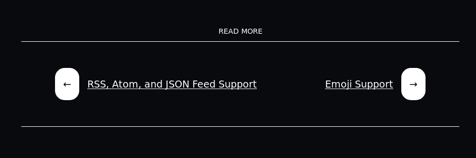
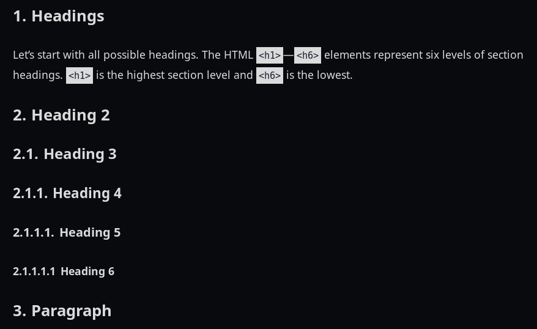

= Arch Terminal
:toc:

:theme_name: Arch Terminal
:prog_version: 2.0.0

// Zoom image
:zoom_image_css_selector: .page__content img
:zoom_image_default_bg: rgba(0, 0, 0, 0.4)

A fork of the original https://github.com/panr/hugo-theme-terminal[Hugo Terminal theme] with some of its original feature set being removed to be replaced for new ones.

Aimed for technical writers, programmers, tech enthusiasts, and people with a do-it-yourself (DIY) spirit. 

This theme provides a minimal and readable base theme while providing a lot of ways to customize it. 

When settling with this theme, you should be prepared for some tweaking of the settings like how you customize your precious text editors and OS configs. 
Also have some prerequisite knowledge of the web languages (HTML, CSS, and JavaScript) for an easier time. 

On an unrelated note, https://github.com/foo-dogsquared/dotfiles[here are my dotfiles]. 

This manual is for {theme_name} version {prog_version} and above.

NOTE: Some of the features are only possible (such as applying and editing SCSS) with Hugo extended version. 
Please make sure that you have it installed. 


== Objectives 

The author of this extended theme (@foo-dogsquared) has several objectives 
in creating this theme. 

Reading this might make you understand the limitations and the strength of this 
theme. 

Here are the following objectives the theme aims to do: 

* Provide an Asciidoctor-supported Hugo theme for those who are writing with 
Asciidoctor. 

* Maintain consistent and readable format for your content. 

* Provide the theme as a UI/skin for your content. 
Nothing more, nothing less. 
Meaning no custom shortcodes and minimal custom frontmatter for your content. 
This also enables easy migration and future-proofing your content 
as much as possible. 

* Go out of its way as much as possible for your content while providing 
customization options in order to fit your general needs. 
You focus on implementing the more advanced and more specific stuff. 

* Be as easy as possible to be able to modify the source files of the theme. 
This theme will not be able to cover all possible (or even common) use cases. 
This encourages creating your own solution if you aren't able to find what you're 
looking for. 


== Demo 

Here's a 
https://foo-dogsquared.github.io/hugo-theme-arch-terminal-demo/[demo] 
of the theme. 
It features a fairly customized version showing off what you can do once 
you invested a bit of your time to experiment and explore the options with this 
theme. 

The raw files can be easily seen in 
https://github.com/foo-dogsquared/hugo-theme-arch-terminal-demo/[my GitHub repo]. 
It should give you an idea of using it in a real-life example. 
The demo also utilizes 
https://travis-ci.com/[Travis CI] as the deployment tool. 
Check out the 
https://github.com/foo-dogsquared/hugo-theme-arch-terminal-demo/blob/master/.travis.yml[config file] 
of it to get an example. 

You can also get the 
https://github.com/foo-dogsquared/hugo-theme-arch-terminal-demo/blob/master/config.toml[configuration] 
of the theme used from the demo. 
It should be usable and can be a great starting point to explore 
the available options and can be used to experiment along reading through the 
documentation. 


== Feature highlights

Here are the different feature highlights that 
the theme offers:

* A recreation of the original theme, built from scratch.
* Focuses on being minimal while being customizable enough for you. 
The choice of bloating your website is in your hands! :) 
* Easy configuration and customization with https://sass-lang.com/[SCSS]. footnote:requires_hugo_extended[Requires Hugo extended version.]
* Primarily focuses on including support for https://asciidoctor.org/[Asciidoctor]. 
* Different approach of content organization. 
* Removed https://nodejs.org/[Node] dependencies from the original theme. 

The theme aims to be minimal but provides a variety of customizability like having a set of building blocks. 
This also holds the philosophy of (almost) full customization to the user, allowing them to express themselves which is why the theme provides lots of optional stuff. 
Even if you start with no options at all, it can be usable. 
Though what's the fun if you can't tweak some settings, right? 

Here's a general list of options that you can set and experiment with this theme. 
(Note that all of the listed features needs to be manually activated. 
It's supposed to be minimal, after all.)

* Support RSS, Atom, and JSON feeds. 
* Suitable for creating a quick single homepage portfolio and/or blogging. 
* https://www.mathjax.org/[MathJax] support. 
* Lazy syntax highlighting support https://prismjs.com/[PrismJS]. footnote:requires_hugo_extended[] 
* Multilingual mode support. 
* Theme switch toggle (also known as dark mode).
* Customizable normal and alternate theme appearance. The theme will also set 
the alternate theme even if you didn't customize it yourself! 
(Though, may result in ugly colors.) footnote:requires_hugo_extended[]
* Site breadcrumbs. 
* LaTeX-like content counters. 
* Customizable social links. 
* Custom 404 messages. 
* Custom content reader mode for easier readability for your readers. 
* Twitter cards, OpenGraph schema, and JSON+LD schema. 
* Image zoom feature for your content. footnote:requires_hugo_extended[]
* Built-in search indexing and widget with https://fusejs.io/[Fuse.js]. footnote:requires_hugo_extended[]
* Quick taxonomy search query list. 
* Adding custom JS libraries for the whole site or for specific posts. 
* Google Analytics integration. 
* Disqus integration. 

Interested to know more? 
Please take a gander at the whole document to know your options. 


== Changelog

To keep up with the changes and latest features, you can view the link:CHANGELOG.adoc[changelog]. 

All future features has to be implemented in a separate development branch (`develop`) and you can view the pending changes there. 


== Installation

Since this theme uses Hugo Pipes and asset bundling, it requires the extended version of Hugo. 
In order to check whether or not you have the extended version installed, just run `hugo version` and check for the keyword `extended` after the version number.

For future references and safety purposes, make sure that the version is at least `v0.57.2`.

If you're using Asciidoctor, make sure that the version is at least `v2.0.10`. 


TIP: Harnessing the full feature set such as editing and applying SCSS and JavaScript files requires Hugo extended version. 


=== Adding it as a clone

Assuming you have installed the appropriate programs and using https://git-scm.com/[Git], you can clone it directly to your Hugo folder:

[source,bash]
----
git clone https://github.com/foo-dogsquared/hugo-theme-terminal-plus-minus.git themes/terminal-plus-minus
----

If you don't want to make any radical changes, this is the best option since you can simply update it (i.e. `cd themes/terminal-plus-minus && git fetch`) whenever updates are available.


=== Adding it as a submodule  

You can also include it as a https://git-scm.com/book/en/v2/Git-Tools-Submodules[git submodule]. 
This option is mostly suitable if you want to make changes to the theme from its layouts, partials, and assets. 

[source,bash]
----
git submodule add https://github.com/foo-dogsquared/hugo-theme-terminal-plus-minus.git themes/terminal-plus-minus
----


== Libraries used

For future references, here is the list for the libraries included with this theme along with their version:

* https://www.mathjax.org/[MathJax] v2.7.6 and v3.0.0 under Apache License Version 2.0 (all versions) 
* https://highlightjs.org/[highlight.js] v9.15.10 under MIT License (with additional terms) 
* https://prismjs.com/[PrismJS] v1.17.1 under MIT License 
* https://fusejs.io/[Fuse.js] v3.4.5 under Apache License Version 2.0 
* https://github.com/francoischalifour/medium-zoom[medium-zoom] v1.0.4 under MIT License 


== Configuration

The theme doesn't require any advanced configuration. 
You can copy the sample configuration below and try to experiment with it.
https://gohugo.io/getting-started/configuration/[Default configuration settings] also apply here. 

NOTE: From this point, this assumes that you want to create the config as a TOML file. 
Please change the format according to your chosen data format for your configuration file. 

[source,toml]
----
baseURL = "https://example.com/"
languageCode = "en-us"
title = "Arch Terminal"
description = "Generic description!"
summaryLength = 15
paginate = 5
disqusShortname = "doogo"
copyright = "Unless explicitly stated, all content released here are licensed under [CC BY-NC-SA 4.0](https://creativecommons.org/licenses/by-nc-sa/4.0)."

[author]
    name = "John Dodo"
    alias = "ordinary-extinction"
    email = "johndodo@example.com"

[menu]
    [[menu.main]]
        identifier = "articles"
        name = "Articles"
        url = "articles/"

    [[menu.main]]
        identifier = "about"
        name = "About"
        url = "about/"

    [[menu.main]]
        identifier = "archives"
        name = "Archives"
        url = "archives/"

    [[menu.main]]
        identifier = "rss"
        name = "RSS"
        url = "index.xml/"

[params]
    # The subtitle of the blog. Mostly appears in the <title> tag.
    subtitle = "Blogger"
    keywords = ["John Dodo", "ordinary-extinction", "blog"]

    # The tagline that'll appear in the homepage as the first header. 
    tagline = "Making near destructive blogs all around the world."
        
    # Show posts on home. :)
    hidePostsOnHome = true
    
    # Indicates if the site sections should be listed instead.
    # Requires `hidePostsOnHome` to be disabled.
    # listSiteSectionsOnHome = true 

    # Enables syntax highlighting. ;p
    enableLazySyntaxHighlighting = true
    
    # Indicates to show the icon whether the link leads to a page or a section. 
    # The effect is visible if `hidePostsOnHome` is at least disabled. 
    # showPageTypeIcon = true
    
    # Shows breadcrumbs in the post.
    # enableBreadcrumbs = true
----


=== Changing appearance 

NOTE: Editing and applying SCSS files is only possible with Hugo extended version. 
If you are using the basic version, override the styles with a CSS stylesheet at `static/scss/main.min.css` (or the equivalent `static` location at the assets folder). 

If you want to change common styles like the background color, text color, or the main color, you can add a `config.scss` file in `assets/scss` in your Hugo project directory.
You can view the link:assets/scss/default.scss[default SCSS config file] for a reference to what variables should be filled. 

If you want to override the styles, you can create a file named `extend.scss` in `assets/scss` of your Hugo project directory. 
From there, you can simply add/modify/remove some styling rules yourself. 

If you want to add some custom fonts, make sure you'll define them through https://developer.mozilla.org/en-US/docs/Web/CSS/@font-face[`@font-face`] rule. 
For placing font files, you can put them in the `static/fonts` folder. 

For those who haven't encountered SCSS yet, it's almost like a superset of CSS but with additional stuff. 
Here's a https://sass-lang.com/guide[guide] and the https://sass-lang.com/documentation/[documentation] page to get started. 


== Making a portfolio site

This theme is suitable for creating a single portfolio page.
Please continue to the following sections for the available options and other stuff you might need to know.


=== Related configuration options 

Here are the main site config options you may want to look out for if you want to create a single page portfolio site:

[cols="5*",options="header"]
|===
| Key
| Data type
| Description
| Optional
| Additional notes

| `title`
| string
| This is the title to appear in the header logo.
Also appears in the `<title>` of the web page.
| 
| 

| `author.name`
| string
| The real name of the author.
| 
| 

| `author.alias`
| string
| The handle/username/alias of the author.
| Yes 
|

| `copyright`
| string 
| The string to appear in the copyright part of the page which is in the very bottom. 
It'll be converted to Markdown so valid Markdown string can be put in the file.
| Yes 
| 

| `params.enableMathjax`
| boolean
| Enables MathJax in the page. 
| Yes (but not for me) 
| For performance reasons, it'll be used through a CDN. 
Also uses version 3. 
If you want to use the previous major version (2.7.6), you can set `setMathjaxToV2` to `true`.

| `params.enableThemeToggle` 
| boolean 
| Enables theme toggling. 
Puts an additional theme toggle button at the header logo. 
| Yes (but no for others) 
| 

| `params.keywords`
| array[string]
| A list of keywords related to your site. 
| Yes
| Quite important if you consider search engine optimization (SEO). 

| `params.notFoundHeader`
| string 
| The message of the 404 header. 
| Yes 
| 

| `params.notFoundLinkMessage`
| string 
| The message of the 404 link message. 
| Yes 
| 

| `params.notFoundMessage`
| string
| The message of the 404 text. 
| Yes 
| 

| `params.subtitle`
| string
| The subtitle for your blog.
Usually, this is where you put your position, occupation, or whatever. 
| Yes
| Also appears in the `<title>` of the web page in the format `<TITLE> - <SUBTITLE>` in the homepage.

| `params.tagline`
| string
| This will appear in the homepage as the first header to be seen.
| Yes
| 

|===


=== Adding projects

You can also add some projects to your data by adding a data file named `projects` (i.e. `projects.json`, `projects.yaml`, etc.) into your https://gohugo.io/templates/data-templates/[data folder].
Make sure that the data file holds an array/list of objects/dictionaries with the specified fields.

When there's at least one project, a projects section will be added into your homepage and the data added in the appropriate folder is added under it.

Anyhow, here's the following keys/fields that the theme look for:

[cols="5*",options="header"]
|===
| Key
| Data type
| Description
| Optional
| Additional notes

| `id`
| string
| The identifier for the project.
| 
| 

| `name`
| string
| The name of the project. 
This is the name that'll appear in the homepage. 
| 
| 

| `description`
| string
| The description of the project.
| Yes
| 

| `link`
| string
| The website/homepage of the working project. 
| Yes
| This is not where the link to the remote repository of the project. 

| `repo`
| string
| The link to the repo of the project.
| Yes 
| 

|===

If you want to see a live example of it, you can check out my https://github.com/foo-dogsquared/foo-dogsquared.github.io[the repo of my own site] and check the output of it in https://foo-dogsquared.github.io/[my site].


=== Adding contact

If you want to add some links to your other stuff like GitHub, GitLab, Twitter, and whatnot, you can add a data file named `contacts` (i.e. `contacts.json`, `contacts.yaml`, etc.) in the https://gohugo.io/templates/data-templates/[data folder].
Like the `projects` data file, make sure that it contains an array/list of objects/dictionaries with the specified fields. 

Here's a table of the following key/fields that theme looks for:

[cols="5*",options="header"]
|===
| Key
| Data type
| Description
| Optional
| Additional notes

| `id`
| string
| The identifier for the object.
| 
| This ID will be used as the `symbol` in the SVG spritesheet file in `static/social-icons.svg` in the theme folder. 
The social icons are extracted from https://github.com/simple-icons/simple-icons[Simple Icons set]. 

| `url`
| string
| The hyperlink of the additional contact.
| 
| 

| `name`
| string
| The name of the contact link.
| Yes
| If the links are set to be text, the value of this key will be used.
Otherwise, if the links are set to be text and there's no value to this key, the `id` will be used, instead.

| `img` 
| string 
| The URL of the image to be used. 
This'll be only used if `useLinkIcons` is set to `true`. 
| Yes 
| Any contact with the missing key will not appear in the footer so make sure all of the contacts have this key. 

|===

By default, the hyperlinks for your contacts are in text. 
If you want to make it into an icon, you could set the parameter `params.useLinkIcons` to `true` in the site config file.
Be cautious of using this, since any unavailable icons will not be rendered. 

.`useLinkIcons` set to `true`


.`useLinkIcons` set to `false` (recommended)
image::docs/show-link-icons-disabled.png[width=100%]


=== Color scheme toggle configuration 

You can have theme toggling (or dark mode as others might call it) for your site. 
It is disabled by default but you can enable it by setting `params.enableThemeToggle` on your site configuration. 

You can also customize your second theme from its background to its font (actually, I think that's it). 
See the link:assets/scss/default.scss[`assets/scss/default.scss`] file to see the variables needed for the second theme. 

If the second theme is not explicitly configured, it'll be derived from the first theme. 
Beware as it will usually get ugly results. 
Manually configuring it yourself is still the best way. 


== Making a blog site

This theme is also suitable to be a blogging theme. 
Most of the stuff from making a single homepage site also applies here.

With the focus on blogging, content organization should be a breeze.
(Of course, as long as it follows the way of https://gohugo.io/content-management/organization/[organizing content from Hugo].)

Unlike the original theme, it doesn't find a name of the folder to list its pages. 
Instead, all of the files and directories under `content/` should be able to be listed (except for the top-level files probably).

If you want to make a post series, you could either put the content files under `posts/` and assign the same category to all of them or simply make a folder named after the series and put the content files there.


=== Related configuration options 

There are some parameters in the site configuration you might want to try out if you're using it for blogging. 

[cols="5*",options="header"]
|===
| Key
| Data type
| Description
| Optional
| Additional notes

| `params.enableBreadcrumbs`
| boolean
| Enables https://www.smashingmagazine.com/2009/03/breadcrumbs-in-web-design-examples-and-best-practices/[site breadcrumbs] in the posts (single page templates) that'll appear at the top of the post.
| Yes
| 

| `params.enableContentImageZoom` footnote:requires_hugo_extended[]
| boolean 
| Adds a Medium-like image zoom functionality in your content with the https://github.com/francoischalifour/medium-zoom/[medium-zoom] library. 
| Yes 
| You can set the background color with `params.setContentImageZoomBackground`. 

| `params.enableContentPagination` 
| boolean 
| Enables the content pagination section in your single page templates that is found at the bottom of the content section. 
| Yes 
| 

| `params.enableJsonLdSchema` 
| boolean 
| Creates a https://www.w3.org/TR/json-ld/[JSON+LD] schema for additional SEO capabilities. 
| Yes 
| 

| `params.enableSiteSearch` footnote:requires_hugo_extended[]
| boolean
| Enables navigation through searching. 
The search widget is located at the bottom of the page. 
| Yes
| To enable built-in site-wide search widget, it requires a two-step setup. 
This is only half of the step. 
You can find out more on the related section. 

| `params.enableLazySyntaxHighlighting` footnote:requires_hugo_extended[]
| boolean
| Enables lazy syntax highlighting without relying to the built-in highlight shortcode.
This uses https://prismjs.com/[PrismJS] for the highlight feature.
| Yes
| This also enables native syntax highlighting for Asciidoctor! 
Hallejulah! 

| `params.enableMathjax`
| boolean
| Enables MathJax in the page.  
| Yes (but not for me) 
| For performance reasons, it'll be used through a CDN. 

| `params.enableOpenGraphSchema` 
| boolean 
| Adds OpenGraph meta tags to the site for improved SEO. 
| Yes 
| 

| `params.enableThemeToggle` 
| boolean 
| Enables theme toggling. 
Puts an additional theme toggle button at the header logo. 
| Yes (but no for others) 
| 

| `params.enableTwitterCard` 
| boolean 
| Adds the appropriate meta tags to be shareable for Twitter. 
| Yes 
| 

| `params.feedLimit` 
| boolean 
| Specifies how many posts should be listed at a time in the output formats (i.e. RSS, Atom, etc.). 
Default value is 10. 
Values less than or equal to 0 is also considered to the default value. 
| Yes 
| 

| `params.hidePostsOnHome`
| boolean
| Indicates if the homepage should hide the pages 
from the content folder.
| Yes
| 

| `params.listSiteSectionsOnHome`
| boolean
| Indicates if the homepage should list the site sections (top-level directories of the site) instead of the pages 
| Yes
| You need to have `hidePostsOnHome` disabled to 
make have this effect visible. 

| `params.mainSections` 
| array[string] 
| Lists the sections you want to be featured on the homepage. 
If absent, it just lists from all sections (except the top-level pages). 
| Yes 
| 

| `params.readMoreLabel` 
| string 
| Replaces the "Read more" text at the very end of the summary of each post.
| Absolutely 
| 

| `params.readOtherPostsLabel`
| string 
| Replaces the label of the content pagination header. 
| Yuparoo
| 

| `params.searchLabel`
| string 
| Replaces the search label in the search widget (if activated).
| Yessir
| 

| `params.setContentImageZoomBackground` footnote:requires_hugo_extended[]
| string 
| Sets the background of https://github.com/francoischalifour/medium-zoom/[medium-zoom] image overlay. 
Accepts any valid CSS color string including `rgb(a)`, `hsl(a)`, or hex codes. 
| Yes 
| 

| `params.showPageTypeIcon`
| boolean
| Shows the icon for page type (either if it's a folder or a file in 
the content folder) in the home page.
| Yes, completely
| For the theme, a page is a "folder" if its base filename is `_index`. 

| `params.useContentCounters`
| boolean 
| Puts a counter similar to 
https://en.wikibooks.org/wiki/LaTeX/Counters[LaTeX counters] for your content. 
| Oh yes 
| Only has a depth of 5 counters (`<h2>`, `<h3>`, `<h4>`, `<h5>`, `<h6>`). 
Anything after that means you need to rethink your document structure (unless you're 
writing technical standards/specifications). 

|===


=== Content organization

The way how the theme organizes content (and encourages) is simple. 
The theme considers all of the pages and sections except for the top-level pages. 

You can also specify to list only certain sections by setting https://gohugo.io/functions/where/#mainsections[`params.mainSections`]. 

By default, the theme list posts in the homepage. 
If you want to disable it, have the `params.hidePostsOnHome` set to `true`.  

NOTE: Folders with an `_index` file is considered a section so it'll be listed. 
Make sure any pages that shouldn't normally appear in the post list be a single page. 

If you want to list sections instead of the page, you should enable the `params.listSiteSectionsOnHome` to `true` on the site config file. 
Take note that the `params.hidePostsOnHome` also needs to be disabled for this setting to work.

.`listSiteSectionsOnHome` set as `true` 
image::docs/list-site-sections-on-home-enabled.png[width=100%] 


=== Content frontmatter

Assuming you didn't modify the theme in any way, here are some of the keys in the content frontmatter used by the theme:

[cols="5*",options="header"]
|===
| Key
| Description
| Optional
| Additional notes
| Example

| `title`
| The title of the post.
| Yes but actually no
| If the given data is null or not valid, it'll appear 
with no title at all and it'll be a pain to sort this out so 
you're on your own, pal.
| `"Markdown Syntax Guide"`

| `date`
| The publication date of the post.
| Yes but actually no
| If the given data does not result to a proper date format or if it's null value, its publication date will appear as published on 2001-01-01 (January 1, 2001).
Also a pain to sort this out. 
| `2019-08-25T21:06:56+08:00`

| `categories`
| The categories associated with the post. 
*Must be an array composed of only one string.* 
This is mostly for the default setting from 
https://jekyllrb.com/[Jekyll]. 
| Yes 
| One of the https://gohugo.io/content-management/taxonomies/#default-taxonomies[default taxonomies].
Mainly useful to establish general grouping for your posts. 
Categories are not included in building feeds. 
| `["guide"]`

| `tags`
| The tags associated with the post. 
*Must be an array with at least one string.* 
| Yes
| Also one of the https://gohugo.io/content-management/taxonomies/#default-taxonomies[default taxonomies]. 
Mostly useful for establishing some indexes for the posts. 
Also used for the output format feeds (RSS, Atom, JSON feed). 
| `["markdown", "guide"]`


| `author`
| The author of the particular post.
| Yes 
| Use this if you have a guest post or has multiple authors in the site.
| `"Rob Pike"`

| `cover`
| The banner image of the post. 
| Yes
| Accepts URL or a relative path to the image.
| `http://i3.ytimg.com/vi/dQw4w9WgXcQ/maxresdefault.jpg`

|=== 


=== Content pagination 

The theme offers an optional pagination section on single page templates where the previous and next entries are shown. 

To enable this feature, set `params.enableContentPagination` to `true`. 




=== Post archive page

You can make a quick archive page by creating a content file with the content type as `archive`. 
Assuming that you have `content/archives.md` as the page for the archive, create a frontmatter similar to the following.

[source,yaml]
----
---
title: "Archives"
date: 2019-08-28T14:32:44+08:00
type: "archive"
---
----

Don't forget to edit the site config file accordingly. 
In this case, the added setting should be an additional item in the navigation menu which is controlled by the `menu` parameter. 

[source,toml]
----
[menu]
    // ...
    [[menu.main]]
        identifier = "archives"
        name = "Archives"
        url = "archives/"
----

Here's a sample of the archive page in the site.


=== Content counters 

You can enable content counters that behave similarly to https://en.wikibooks.org/wiki/LaTeX/Counters[LaTeX counters] by setting `params.useContentCounters` to `true`. 

.Content counters 


This is mostly helpful to quickly establish hierarchy and not to make it confusing for your readers. 

The counters are only enough to support the HTML tags `<h2>`--`<h6>` (`<h1>` is assumed to be the main document title). 
Any more than that (if that's even possible) is not supported anymore and can only go through some more tweaking. 


=== Site breadcrumbs in post

The most useful one is the breadcrumbs feature that'll appear in the top of your posts.

.Breadcrumbs in the post


In order to be able to use it, set the `params.enableBreadcrumbs` to `true` in your site config file. 


=== Content image zoom  

You can add an image zoom feature similar to the image zoom function 
in Medium articles. footnote:requires_hugo_extended[]

Of course, it's disabled by default and should be manually enabled with 
`params.enableContentImageZoom`. 

It relies on https://github.com/francoischalifour/medium-zoom/[medium-zoom] for the 
functionality and its script can be found on `assets/js/lib/medium-zoom.js`. 
The script is modified to only add the zoom functionality to the valid elements in 
the CSS selector string `{zoom_image_css_selector}` which can only be found on 
single page templates. 

NOTE: The version used in the theme is at v1.0.4. 

The theme offers one way of customizing the background color with 
`params.setContentImageZoomBackground`. 
It accepts a valid CSS color string such as a hexadecimal code, 
RGB (and RGBA), HSL (and HSLA), and the color name. 
The default background of the overlay is `{zoom_image_default_bg}`. 


=== Quick taxonomy search list

This featured is inspired from 
https://www.ii.com/[this site's taxonomy pages]. 
It provides a quick list of search queries of different sites when in a https://gohugo.io/content-management/taxonomies/[taxonomy page] located at the bottom of the page. 

It can be customized by providing a data file named `query` which holds a list of objects/dictionaries with the following keys:

[cols="5*",options="header"]
|===
| Key
| Data type
| Description 
| Optional
| Additional notes

| `id`
| string
| The name of the site. 
| 
| The list will be sorted alphabetically based from this key. 

| `url`
| string
| The URL of the site that leads to a search results page. 
| 
| Requires the pattern `${{\\__DATA__}}` somewhere in the string to denote the taxonomy term. 

|===


=== Other tidbits

There are a couple of options for miscellaneous stuff and info that you might want to find out. 

==== "Back to top" button 

You can simply put a simple back to top button with `params.enableBackToTopLink`. 
It's located at the footer just before your contact links. 

==== Icon on post list

Another one of the features you could try it out is the icons that'll appear in the side of the post list. 
This indicates whether or not the list item is a page or a section. 
It could be useful for navigating your site.

.`showPageTypeIcon` set as `true` with a "file" type page
image::docs/page-type-icon-file.png[width=100%]

.`showPageTypeIcon` set as `true` with a "folder" type page


In order to enable it, set the `params.showPageTypeIcon` to `true`.


== Multilingual mode support 

This theme supports https://gohugo.io/content-management/multilingual/[multilingual mode] for your site. 
Please see the linked documentation and https://regisphilibert.com/blog/2018/08/hugo-multilingual-part-1-managing-content-translation/[this featured blog post] to get started. 

In order to get started, add the language(s) that you'll be hosting your content with the `languages` object in your site configuration. 
For consistency, the theme requires a language code based from https://www.iana.org/assignments/language-subtag-registry/language-subtag-registry[IANA Language Subtag Registry] as defined from the https://www.w3.org/International/questions/qa-choosing-language-tags[W3 documentation]. 

The language selector can be found at the very bottom of the site. 
Any content with translations are also introduced along with the content metadata and 
the title. 

The theme should be able to support changing the tiny details such as the 
title and the menu as long as you provided the appropriate data. 

You can find the translations files at link:./i18n[`i18n`] folder with the 
available languages. 
If the language you find is not available, you can help translating 
it and add it into the supported language list. 

NOTE: Personally, I recommend to make your site config into a 
https://gohugo.io/getting-started/configuration/#configuration-directory[`config` folder]. 
It's going to make site config management more organized. 


== Adding your own libraries 

=== Adding it sitewide 

TIP: If you want finer control, I recommend to modify the script partial of the theme 
instead (at `theme/arch-terminal/layouts/partials/scripts.html`). 
By doing it this way, you can add some additional scripts such as configuration 
of your library or rearranging it. 

This theme supports adding your own JS libraries and CSS stylesheets to your site 
quickly by utilizing a data file named `libraries`. 

By providing this feature, you can quickly add some features such as supporting 
engineering-oriented content with https://mermaidjs.github.io/[Mermaid], 
https://www.chartjs.org/[Chart.js], and similar libraries. 
Or you could replace the syntax highlighters here. 

Similar to adding your projects and contact links, the data file should hold a list 
of objects with certain keys/fields. 

[cols="5*",options="header"]
|===
| Key 
| Data type
| Description
| Optional
| Additional notes 

| `type` 
| string 
| Specifies what type of resource the item will be. 
Only accepts possible values which are `js` and `css`. 
| 
| 

| `url` 
| string 
| The URL of the JS file to be loaded. 
| 
| 

| `weight` 
| number 
| The order which the script will be loaded. 
Similar to the `weight` field from Hugo menu object, 
the less weight, the higher the precedence. 
Make sure the more important scripts have the least weight value. 
| 
| 

| `sync` 
| boolean 
| Makes the script a part of the DOM rendering. 
Removing the `async` attribute on the process. 
| Yes 
| By default, custom scripts have the attribute of `async` on the 
`<script>` element. 

| `defer` 
| boolean 
| Adds the `defer` attribute to the corresponding `<script>` element. 
| Yes
| If the value is `true`, the script will be deferred no matter what. 

|===


=== Adding JS libraries for a specific post 

TIP: If you plan on future-proofing your content, I recommend to 
embed it on the document itself than relying on the frontmatter since this is 
a theme-specific feature and may present some problems if you migrate it somewhere else. 
For Markdown, you can simply write raw HTML with it. 
On Asciidoctor, you can simply embed it with a 
https://asciidoctor.org/docs/user-manual/#passthroughs[passthrough block]. 
You also gain finer control on embedding your scripts this way. 

You can also add a JS file to a specific document by adding a 
`libs` object with `js` nested object on the frontmatter. 

Let's say you're writing an article on https://p5js.org/[p5.js]. 
Rather than adding the library site-wide (which is very inefficient), you can 
add it for that specific page. 
Here's how you can add it to your frontmatter.

[source,asciidoc]
----
---
title: "Testing out p5.js"
date: 2019-09-07T02:55:46+08:00

libs:
    js:
        - "https://cdnjs.cloudflare.com/ajax/libs/p5.js/0.9.0/p5.min.js"
---
----

Libraries and scripts imported this way are loaded first before the site-wide scripts. 
Also, all of them are loaded asynchronously (with the `async` attribute) and you 
have no way of controlling them. 
If you're looking for finer control, I recommend to embed them into the document 
itself instead. 


== Custom 404 page

If you want to change it, simply copy link:layouts/404.html[`layouts/404.html`] 
from the theme folder to your own `layouts` folder and change it from there. 

As the official documentation has said, you can only see the 404 page in the 
server mode by visiting `localhost:1313/404` (or something similar if you have 
different ports for your `localhost`).


== MathJax support

MathJax is included with the theme and needs almost no configuration 
in order for it to work. 
Like most of the highlighted features here, it's disabled by default. 
You can enable by setting `params.enableMathjax` to `true`. 

By default, it uses v3.0.0 which is the latest production 
version as of 2019-09-06. 

Take note that it uses the default configuration so there 
might be some need to configure it. 
In case that you do need configuration, you can copy the script partial 
(at `theme/{theme_name}/layouts/partials/scripts.html`) and add the configuration 
at the appropriate location (there should be a comment telling you where to put it). 

NOTE: Read the 
https://docs.mathjax.org/en/latest/[official MathJax documentation for more information] 
and to understand more how this theme integrates MathJax. 

Assuming you didn't change the configuration or anything, here are 
the breakdown for writing LaTeX in the web according to the 
https://docs.mathjax.org/en/latest/start.html#tex-and-latex-input[MathJax documentation].


For Markdown-based files:

* Inline math content should be delimited with a pair of backslash 
and parenthesis (\\(...\\)).
* Display/block math mode should be delimited with a pair of 
square brackets (\\[\\]) or two dollar signs (\$\$). 
You may have to escape it with a backslash (\).

.Example of math content in a Markdown file
[source,markdown]
----
For inline math, you could make dollar signs-delimited content blocks like
the following example and it'll appear like $a_{1}^{2} + a_{2}^{2} = b_{1}^{2} + b_{1}^{2}$.

For display/block math mode, make the content block delimited with two dollar signs 
or a pair of brackets.

\[\LaTeX\]
----


For Asciidoctor-based files:

* Math support is included in Asciidoctor but 
https://asciidoctor.org/docs/user-manual/#activating-stem-support[you have to enable it by putting `:stem:` in the preamble]. 
The theme already takes care of that for you by including it in the archetype template. 
* Since the theme uses the default setting for MathJax, the stem interpreter is explicitly 
set to `latexmath`. 
* Inline math content should be put in the `stem` macro. 
* Display/block math content should be put in the stem block. 

.Example of math content in a Asciidoctor file
[source,asciidoc]
----
= Document title
:stem: latexmath

For inline math, you could make dollar signs-delimited content blocks like
the following example and it'll appear like stem:[a_{1}^{2} + a_{2}^{2} = b_{1}^{2} + b_{1}^{2}].

For display/block math mode, make a stem block.

[stem]
++++
\LaTeX
++++
----


== Lazy syntax highlighting 

NOTE: This requires Hugo extended version in order to work. 

Lazy syntax highlighting (enabling it without the `highlight` shortcode) 
is supported through https://prismjs.com/[PrismJS]. 
The syntax highlighter encourages the
https://www.w3.org/TR/html52/textlevel-semantics.html#the-code-element[semantic HTML for code listings] 
in order to color the syntax.

Fortunately, both of the default Markdown parsers and Asciidoctor 
outputs semantic HTML for code listings so both of them are supported. 

By default, the lazy syntax highlighting is disabled. 
To enable it, set the `enableLazySyntaxHighlighting` under 
`params` to `true` in your site config file. 

Assuming you're using a TOML as your config file.

[source,toml]
----
[params]
    # ...
    enableLazySyntaxHighlighting = true
----

NOTE: If you're curious to the files being used, the script for 
the syntax highlighters is at `assets/js/lib` of the theme folder. 
It has a high filesize (~400KiB for PrismJS). 
I recommend to replace them with the same file over at your assets folder. 
Or you could also modify the scripts partial and link them through a CDN. 

Now that lazy syntax highlighting is enabled, you can simply use the 
normal code listings with Markdown or Asciidoctor (other formats are yet to be 
tested) like so:

.Markdown source code listing
[source,markdown]
----
```js
console.log("Hello world");
```
----

.Asciidoctor source code listing
[source,asciidoc]
....
[source,js]
----
console.log("Hello world");
----
....


=== Changing themes 

The CSS used for syntax highlighting is at `assets/css/` file. 
There should be separate stylesheet for each syntax highlighters with the same name (i.e. `prism.css`). 

You can replace the theme by having `prism.css` in the `assets/css` folder. 
You can replace the theme by going to https://prismjs.com/download.html[the PrismJS download page], select the theme you want and putting it in the aforementioned file.  

NOTE: The PrismJS script file contains the core, all of the languages offered as of v1.16.0, and the https://prismjs.com/plugins/keep-markup/[Keep Markup plugin] (this plugin is important if you want to use https://asciidoctor.org/docs/user-manual/#callouts[callouts in Asciidoctor]). 
In order to update PrismJS, you need to download the script file yourself at https://prismjs.com/download.html[the PrismJS download page] and select the languages it'll support.


== RSS, Atom, and JSON output feed 

This is mostly applicable for those who use the theme for blogging. 
The theme support RSS, Atom, and JSON feeds. 

For future references, here are the following documents used to refer in creating the feed templates: 

* https://tools.ietf.org/html/rfc4287[Atom 1.0 - IETF RFC4287]
* https://jsonfeed.org/version/1[JSON Feed version 1 specifications]
* https://cyber.harvard.edu/rss/rss.html[RSS 2.0 specifications] 

The generated RSS and Atom output has been tested against the https://validator.w3.org/feed/[W3C feed validator] and it has been valid so far. 
For JSON feeds, it has been tested on https://json-feed-validator.herokuapp.com/validate[a JSON feed validator] and produces the same valid result.

NOTE: Personally, I recommend using Atom feeds since it is widely recognized and http://www.intertwingly.net/wiki/pie/Rss20AndAtom10Compared[it does have a better format than RSS]. 

In order to enable it, utilize custom formats in your site configuration. 

The output format template is in the layout folder named `index` with their respective file extensions (`.rss`, `.atom`, `.json`). 
They also have a list counterpart at `_default/list` with the same respective file extension. 

All of them support outputs for the homepage (from `index.$FILE_EXT`) and lists (from `list.$FILE_EXT`). 

Here's an example which will make all of the feeds appear at `index.rss`, `index.atom`, and `index.json`. 

[source,toml]
----

# Visit the following for more information:
# https://gohugo.io/templates/output-formats

# Defining the media type of the output formats
# For JSON format, it doesn't need to be since it's already built-in into Hugo
[mediaTypes]
    [mediaTypes."application/atom+xml"]
        suffixes = ["atom", "atom.xml"] # You can remove the "atom.xml" if you want
    
    # Redefining RSS media type for the additional suffix
    [mediaTypes."application/rss+xml"]
        suffixes = ["rss", "rss.xml"] # You can remove the "rss.xml" if you want


# Including all of the feed output formats in the build
[outputFormats]
    [outputFormats.Rss]
        mediaType = "application/rss+xml"
        baseName = "index"

    [outputFormats.Atom]
        mediaType = "application/atom+xml"
        baseName = "index"

# Indicating what output formats shall be included 
# for the following kinds
[outputs]
    # .Site.BaseURL/index.* is available 
    home = ["HTML", "JSON", "RSS", "ATOM"]

    # .Site.BaseURL/$section/index.* is available
    section = ["HTML", "JSON", "RSS", "ATOM"] 
----


=== Limitations 

In order to prevent diving into complexity, there is a set of limitations you have to keep in mind.

* No pagination. 
Only the first 10 (or given `params.feedLimit`) shall be shown at any time to prevent excessive bandwidth usage. 
* It doesn't support multiple site authors. 
It always assumed that the site only has one author. 
* The same deal for posts. 
In case that there is an `author` field in the frontmatter of the post, it'll only support one author, not an array of them. 


== Site search widget 

NOTE: This requires Hugo extended version in order to work. 

This theme offers a site-wide search navigation widget with https://fusejs.io/[Fuse.js] as the search engine. 

How it works is simply through building a static search engine index in `{{ $.Site.BaseURL }}/index.search.json` and utilizing the search engine library when the reader visits a web page. 

CAUTION: This is not recommended for large sites since the search engine will run entirely on the visitor's device. 
Instead, I recommend to use a server-sided search indexing service like https://www.algolia.com/[Algolia]. 

It requires two steps setup to enable it.

* Setting `params.enableSiteSearch` to `true` in your site config. 
* Adding a custom output format for the search index to be built. 

Here's what the site config file should have (assuming it is in TOML): 

[source,toml]
----
# ... 

[mediaTypes]
    # You can set any media type you want but make sure it doesn't have any conflict with 
    # other media types (that'll be used by your site, anyway).
    # Here's the list of registered media types for a reference.
    # https://www.iana.org/assignments/media-types/media-types.xhtml
    [mediaTypes."x-application/search+json"]
        suffixes = ["search.json"]

[outputFormats]
    # ...

    [outputFormats.SearchIndex]
        mediaType = "x-application/search+json"
        baseName = "index"

[outputs]
    home = ["HTML", "SEARCHINDEX"] 

# ...

[params]
    # ... 

    enableSiteSearch = true
----

The feature uses https://fusejs.io/[Fuse.js] as the search engine. 
The file can be found on link:assets/js/lib/fuse.min.js[`assets/js/lib/fuse.min.js`].

.The site-wide search widget
image::docs/enable-site-search-widget.png[The site-wide search widget]


== Issues with Asciidoctor and other stuff

Since Asciidoctor only recieves basic support through https://gohugo.io/content-management/formats/#additional-formats-through-external-helpers[external helpers], there are some imperfections with this theme (rather, overall) when using with Hugo.

* First and foremost, the HTML output of Asciidoctor doesn't observe proper semantics. 
Therefore, some additional styling may be done since it goes against usual content formatting compared to other outputs from other content formats like Markdown. 
This also affects the screen reading accessibility so take utmost caution when creating a workaround like using https://github.com/jirutka/asciidoctor-html5s[an Asciidoctor backend with semantics in design] and https://blog.anoff.io/2019-02-17-hugo-render-asciidoc/[using a shadow executable hack done by a blogger with Hugo and Asciidoctor].

* Using callouts with the `:icons: font` attribute enabled will bring out some problems regarding to rendering the highlighted syntax with https://prismjs.com/[PrismJS]. 
It is advised to use https://highlightjs.org/[highlight.js] instead.


== How to run your site

From your Hugo root directory, run the following command:

[source,bash]
----
hugo server -t terminal-plus-minus
----

You can also add the following line to site config file:

[source,toml]
----
theme = "terminal-plus-minus"
----


== How to contribute

If you spot some bugs or want to suggest a feature, feel free to file an issue in the issue tracker. 

Any feature requests are heavily considered since starting at v2.0.0, a feature freeze is observed for the sake of improving user experience (including the documentations), bug fixes, and content readability for the theme as much as possible. 
It also avoids the problem of over-engineering and gold plating since the theme already has a lot of options/parameters to offer. 


=== Setting up for development

If you want to contribute through code, you can do the following to set up the repo into your computer:

* Fork this repository 
* Clone the forked repository 
* Checkout to the development branch (`develop`) 
* Create another branch from the development branch which you can 
freely implement your own stuff 

Make sure the new branch name is appropriately named. 

If creating a pull request, you have to pass it through the development branch. 


=== Project style guides

If you're going to update the codebase, make sure you mind the following guidelines:

* The documentations have to be written in https://asciidoctor.org/[Asciidoctor]. 
If you're not familiar with it, here's the https://asciidoctor.org/docs/asciidoc-syntax-quick-reference/[quick reference page] for a rundown and their https://asciidoctor.org/docs/user-manual/[user manual] for deep details. 
* The codebase follows the http://getbem.com/naming/[BEM naming convention] for the CSS naming.
* Using https://developer.mozilla.org/en-US/docs/Web/Guide/HTML/Using_HTML_sections_and_outlines[semantic HTML] should be observed.
* Not really a requirement but use the https://editorconfig.org/[EditorConfig] plugin for your text editor. 
If you don't have any, try to follow according to the `.editorconfig` rules. 


== TODO

Here are some of the features that are considered to be implemented. 
Any help with this task list by pull requests are very appreciated. 

* Algolia integration
* Easy GitHub projects integration (for quickly creating your portfolio site)


== Inspirations

* https://bestmotherfucking.website/[Best Motherfucking Website] :) 
* https://practicaltypography.com/[Practical Typography] for a reference in 
typography 
* https://github.com/panr/hugo-theme-terminal[Terminal theme], of course
* https://github.com/achary/engimo[Engimo theme] for the focus in engineering content 
* https://sourcethemes.com/academic[Hugo Academic theme] for the focus in academic content 
* https://github.com/Lednerb/bilberry-hugo-theme/[Bilberry Hugo theme] for the content organization


== License

For the original theme, copyright goes to Radosław Kozieł (https://twitter.com/panr[@panr]).

The original theme is released under the MIT License. 
Check the https://github.com/panr/hugo-theme-terminal/blob/master/LICENSE.md[original theme license] for additional licensing information.

This fork is maintained by https://foo-dogsquared.github.io/[foo-dogsquared] and the extended theme is released under MIT license. 
Copyright applies to my own modifications of the project. 
Please see the previously linked license of the theme for more information on how to properly include copyright notices.

In other words:

© 2019 panr - for the original theme

© 2019 foo-dogsquared - for the modification and extended 
parts of the theme 

(IDK how to proceed with licensing so feel free to correct me pls -_-)
