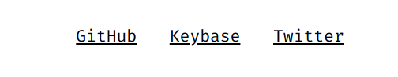
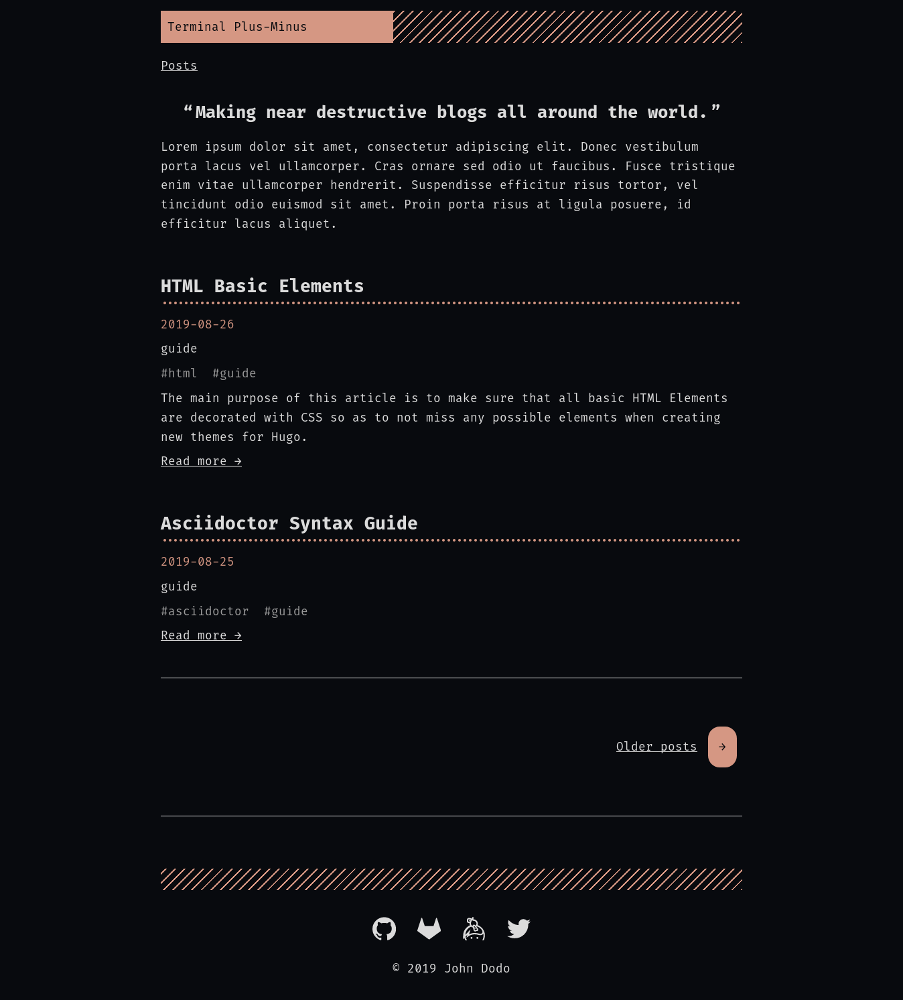
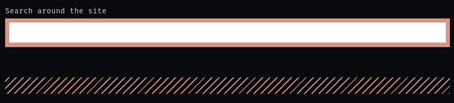
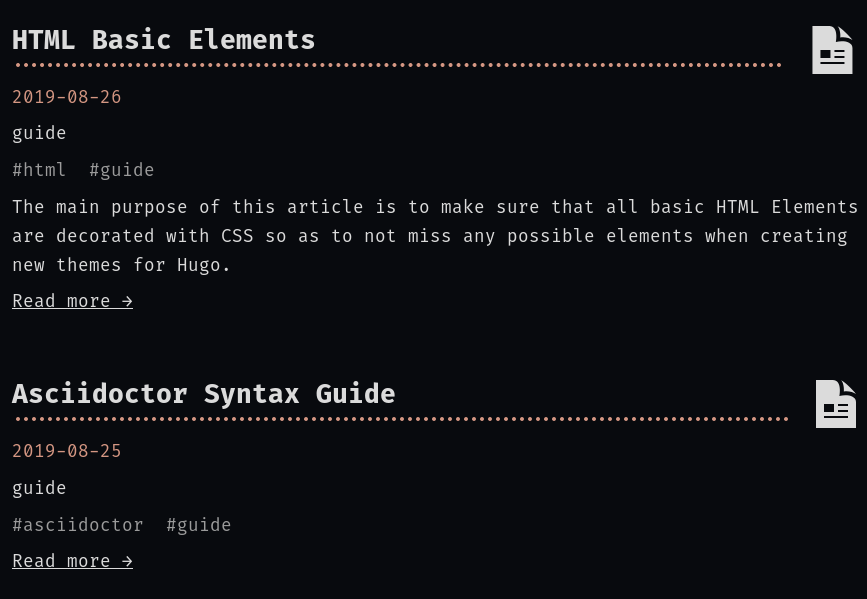

= Terminal Plus-Minus
:toc:

A fork of the 
original https://github.com/panr/hugo-theme-terminal[Hugo Terminal theme] 
with some of its original feature set being removed to 
be replaced for new ones.

Aimed for technical writers, programmers, and tech enthusiasts. 
This theme combines retro vibes with modern-looking styles. 
When settling with this theme, you should be prepared for some 
tweaking of the settings. 

== Demo 

Here's a 
https://foo-dogsquared.github.io/hugo-theme-terminal-plus-minus-demo/[demo] 
of the theme. 

The raw files can be easily seen in 
https://github.com/foo-dogsquared/hugo-theme-terminal-plus-minus-demo/[my GitHub repo]. 
It should give you an idea of using it in a real-life example. 
The demo also utilizes 
https://travis-ci.com/[Travis CI] as the deployment tool. 
Check out the 
https://github.com/foo-dogsquared/hugo-theme-terminal-plus-minus-demo/blob/master/.travis.yml[config file] 
of it to get an example. 

You can also get the 
https://github.com/foo-dogsquared/hugo-theme-terminal-plus-minus-demo/blob/master/config.toml[configuration] 
of the theme used from the demo. 
It should be usable and can be a great starting point to explore 
the available options and can be used to experiment along reading through the 
documentation. 

== Differences from the original

Being a fork of a theme, there are some differences.
Here are the feature highlights (and removals) that 
the theme offers:

* A recreation of the original theme, almost built from scratch
* Easy configuration and customization with https://sass-lang.com/[SCSS]
* Aims on supporting engineering and technical content
* Different approach of content organization 
* Suitable for creating a quick single homepage template and blogging
* Primarily focuses on including support for https://asciidoctor.org/[Asciidoctor] 
* Includes https://www.mathjax.org/[MathJax] support
* Retained syntax highlighting support from https://highlightjs.org/[highlight.js] 
and https://prismjs.com/[PrismJS]
* Reduced internationalization (i18n) support (for now, anyway)
* Removed selection of available themes 
* Removed https://nodejs.org/[Node] dependencies from the original theme 

== Changelog

To keep up with the changes and latest features, you can view the 
link:docs/CHANGELOG.adoc[changelog]. 

All future features has to be implemented in a separate development 
branch (`develop`) and you can view the pending changes there. 

== Installation

Since this theme uses SASS/SCSS asset bundling, it requires 
the extended version of Hugo. 
In order to check whether or not you have the extended 
version installed, just run `hugo version` and check for 
the keyword `extended` after the version number.

For future references and safety purposes, make sure that 
the version is at least `v0.57.2`.

If you're using Asciidoctor, make sure that the version is at 
least `v2.0.10`.

=== Adding it as a clone

Assuming you have installed the appropriate programs and 
using https://git-scm.com/[Git], you can clone it directly 
to your Hugo folder:

[source,bash]
----
git clone https://github.com/foo-dogsquared/hugo-theme-terminal-plus-minus.git themes/terminal-plus-minus
----

If you don't want to make any radical changes, this is the best option 
since you can simply update it 
(i.e. `cd themes/terminal-plus-minus && git fetch`) whenever updates 
are available.

=== Adding it as a submodule  

You can also include it as a 
https://git-scm.com/book/en/v2/Git-Tools-Submodules[git submodule]. 
This option is mostly suitable if you want to make changes to the 
theme from its layouts, partials, and assets. 

[source,bash]
----
git submodule add https://github.com/foo-dogsquared/hugo-theme-terminal-plus-minus.git themes/terminal-plus-minus
----

== Libraries used

For future references, here is the list for the libraries 
included with this theme along with their version:

* https://www.mathjax.org/[MathJax] v2.7.6 
* https://highlightjs.org/[highlight.js] v9.15.10 
* https://prismjs.com/[PrismJS] v1.17.1 
* https://fusejs.io/[Fuse.js] v3.4.5 

== Configuration

The theme doesn't require any advanced configuration. 
You can copy the sample configuration below and try to experiment 
with it.
https://gohugo.io/getting-started/configuration/[Default configuration settings] 
also apply here. 

NOTE: From this point, this assumes that you want to create the 
config as a TOML file.
Please change the format according to your chosen data format for 
your configuration file.

[source,toml]
----
baseURL = "https://example.com/"
languageCode = "en-us"
title = "Terminal Plus-Minus"
description = "Generic description!"
summaryLength = 15
paginate = 5
disqusShortname = "doogo"
copyright = "Unless explicitly stated, all content released here are licensed under [CC BY-NC-SA 4.0](https://creativecommons.org/licenses/by-nc-sa/4.0)."

[author]
    name = "John Dodo"
    alias = "ordinary-extinction"
    email = "johndodo@example.com"

[menu]
    [[menu.main]]
        identifier = "articles"
        name = "Articles"
        url = "articles/"

    [[menu.main]]
        identifier = "about"
        name = "About"
        url = "about/"

    [[menu.main]]
        identifier = "archives"
        name = "Archives"
        url = "archives/"

    [[menu.main]]
        identifier = "rss"
        name = "RSS"
        url = "index.xml/"

[params]
    # The subtitle of the blog. Mostly appears in the <title> tag.
    subtitle = "Blogger"
    keywords = ["John Dodo", "ordinary-extinction", "blog"]

    # The tagline that'll appear in the homepage as the first header. 
    tagline = "Making near destructive blogs all around the world."
        
    # Show posts on home. :)
    showPostsOnHome = true
    
    # Indicates if the site sections should be listed instead.
    # Requires `showPostsOnHome` to be enabled.
    # listSiteSectionsOnHome = true 

    # Enables syntax highlighting. ;p
    enableSyntaxHighlighting = true

    # Set the syntax highlighter to be used. 
    # Only valid options are "highlighterjs" or "prismjs".
    # By default, it uses highlighter.js as the syntax highlighter if there's no set value. 
    # syntaxHighlighter = "prismjs"
    
    # Indicates to show the icon whether the link leads to a page or a section. 
    # The effect is visible if `showPostsOnHome` is at least enabled. 
    # showPageTypeIcon = true
    
    # Shows breadcrumbs in the post.
    # enableBreadcrumbs = true

    # Indicates if certain headers have to be styled.
    # contentIsStyled = true
----

=== Changing appearance

If you want to change common styles like the background color, 
text color, or the main color, you can add a `config.scss` file 
in `assets/scss` in your Hugo project directory.
You can view the link:assets/scss/default.scss[default SCSS config file] 
for a reference to what variables should be filled.

If you want to override the styles, you can create a file named 
`extend.scss` in `assets/scss` of your Hugo project directory. 
From there, you can simply add/modify/remove some styling rules yourself. 

If you want to add some custom fonts, make sure you'll define them through
https://developer.mozilla.org/en-US/docs/Web/CSS/@font-face[`@font-face`] rule. 
For placing font files, you can put them in the `static/fonts` folder. 

For those who haven't encountered SCSS yet, it's almost like a superset 
of CSS but with additional stuff. 
Here's a https://sass-lang.com/guide[guide] and the 
https://sass-lang.com/documentation/[documentation] page to get started. 

== Making a portfolio site

This theme is suitable for creating a single portfolio page.
Please continue to the following sections for the available options 
and other stuff you might need to know.

=== Related configuration options 

Here are the main site config options you may want to look out 
for if you want to create a single page portfolio site:

[cols="5*",options="header"]
|===
| Key
| Data type
| Description
| Optional
| Additional notes

| `title`
| string
| This is the title to appear in the header logo.
Also appears in the `<title>` of the web page.
| 
| 

| `author.name`
| string
| The real name of the author.
| 
| 

| `author.alias`
| string
| The handle/username/alias of the author.
| Yes 
|

| `params.tagline`
| string
| This will appear in the homepage as the first header to be seen.
| Yes
| 

| `params.keywords`
| array[string]
| A list of keywords related to your site. 
| Yes
| Quite important if you consider search engine optimization (SEO).

| `params.subtitle`
| string
| The subtitle for your blog.
Usually, this is where you put your position, occupation, or 
whatever. 
| Yes
| Also appears in the `<title>` of the web page in the format 
`<TITLE> - <SUBTITLE>` in the homepage.

|===

=== Adding projects

You can also add some projects to your data by adding a 
data file named `projects` (i.e. `projects.json`, `projects.yaml`, etc.) 
into your https://gohugo.io/templates/data-templates/[data folder].
Make sure that the data file contains a single key/field named 
`list` that holds an array/list.

When there's at least one project, a projects section will 
be added into your homepage and the data added in the 
appropriate folder is added under it.

Anyhow, here's the following keys/fields that the theme 
look for:

[cols="5*",options="header"]
|===
| Key
| Data type
| Description
| Optional
| Additional notes

| `id`
| string
| The identifier for the project.
| 
| 

| `name`
| string
| The name of the project. 
This is the name that'll appear in the homepage. 
| 
| 

| `link`
| string
| The website/homepage of the working project. 
| Yes
| This is not where the link to the remote repository of the project. 

| `repo`
| string
| The link to the repo of the project.
| Yes 
| 

| `description`
| string
| The description of the project.
| Yes
| 

|===

If you want to see a live example of it, you can check out my 
https://github.com/foo-dogsquared/foo-dogsquared.github.io[the repo of my own site] 
and check the output of it in https://foo-dogsquared.github.io/[my site].

=== Adding contact

If you want to add some links to your other stuff like 
GitHub, GitLab, Twitter, and whatnot, you can add a 
data file named `contacts` (i.e. `contacts.json`, `contacts.yaml`, etc.) 
in the https://gohugo.io/templates/data-templates/[data folder].
Make sure that the data file contains a single key/field named 
`list` that holds an array/list.

Here's a table of the following key/fields that theme looks for:

[cols="5*",options="header"]
|===
| Key
| Data type
| Description
| Optional
| Additional notes

| `id`
| string
| The identifier for the object.
| 
| This ID will be used as the `symbol` in the SVG spritesheet file in 
`static/social-icons.svg` in the theme folder. 
The social icons are extracted from 
https://github.com/simple-icons/simple-icons[Simple Icons set]. 

| `url`
| string
| The hyperlink of the additional contact.
| 
| 

| `name`
| string
| The name of the contact link.
| Yes
| If the links are set to be text, the value of this key will be used.
Otherwise, if the links are set to be text and there's no value to this 
key, the `id` will be used, instead.

|===

By default, the hyperlinks for your contacts are in text. 
If you want to make it into an icon, you could set the 
parameter `params.useLinkIcons` to `true` in the site config file.
Be cautious of using this, since any unavailable icons will 
not be rendered. 
In order to see how this works, it basically relies on using 
https://css-tricks.com/svg-symbol-good-choice-icons/[SVG spritesheets] 
in `static/social-icons.svg` (in the theme folder) with symbols.

.`useLinkIcons` set to `true`
image::docs/show-link-icons-enabled.png[width=100%]

.`useLinkIcons` set to `false` (recommended)

NOTE: The whole spritesheet is extracted from the 
https://github.com/simple-icons/simple-icons/[Simple Icons icon set].

== Making a blog site
This theme is also suitable to be a blogging theme. 
Most of the stuff from making a single homepage site also applies here.

With the focus on blogging, content organization should be a breeze.
(Of course, as long as it follows the way of 
https://gohugo.io/content-management/organization/[organizing content from Hugo].)

Unlike the original theme, it doesn't find a name of the 
folder to list its pages. 
Instead, all of the files and directories under `content/` 
should be able to be listed (except for the top-level files 
probably).

If you want to make a post series, you could either put 
the content files under `posts/` and assign the same category 
to all of them or simply make a folder named after the series 
and put the content files there.

=== Related configuration options 

There are some parameters in the site configuration you might 
want to try out if you're using it for blogging. 

[cols="5*",options="header"]
|===
| Key
| Data type
| Description
| Optional
| Additional notes

| `params.showPostsOnHome`
| boolean
| Indicates if the homepage should show the pages 
from the content folder.
| Yes
| 

| `params.listSiteSectionsOnHome`
| boolean
| Indicates if the homepage should list the 
site sections (top-level directories of the site)
instead of the pages 
| Yes
| You need to have `showPostsOnHome` set to `true` to 
make have this effect visible.

| `params.showPageTypeIcon`
| boolean
| Shows the icon for page type (either if it's a folder or a file in 
the content folder) in the home page.
| Yes, completely
| For the theme, a page is a "folder" if its base filename is `_index`. 

| `params.contentIsStyled`
| boolean
| Makes the single page template content to have 
some styles into them (see the resulting headers, for example).
| Yes
| This is just for decorative purposes.

| `params.enableSyntaxHighlighting`
| boolean
| Enables "native" syntax highlighting without relying to the 
built-in highlight shortcode.
This uses https://prismjs.com/[PrismJS] for the highlight feature.
| Yes
| This also enables native syntax highlighting for Asciidoctor! 
Hallejulah!

| `params.syntaxHighlighter` 
| string 
| Sets the syntax highlighter to be used. 
Valid options include `highlightjs` and `prismjs`. 
When no value is given, it'll use highlight.js as the default 
syntax highlighter.
| Yes 
| Despite being the same in goal (coloring syntax), it has subtle 
differences in results. 
See the "Issues in Asciidoctor and other stuff" section. 

| `params.enableBreadcrumbs`
| boolean
| Enables 
https://www.smashingmagazine.com/2009/03/breadcrumbs-in-web-design-examples-and-best-practices/[site breadcrumbs] 
in the posts (single page templates) that'll appear at the top of the post.
| Yes
| 

| `params.enableSiteSearch`
| boolean
| Enables navigation through searching. 
The search widget is located at the bottom of the page. 
| Yes
| This feature is experimental. 
Don't expect a lot of stability with this. 
If your site is large enough, I recommend to integrate with stronger tools 
such as Algolia.

| `params.readMore` 
| string 
| Replaces the "Read more" text at the very end of the summary of each post.
| Absolutely 
| 

|===

=== Content organization

The way how the theme organizes content (and encourages) 
is simple. 
The theme considers all of the pages and sections except for 
the top-level pages. 

By default, the theme does not list posts in the homepage. 
In order to do so, set the `params.showPostsOnHome` to `true` on 
your site config file. 
All of the posts (except for the top-level pages) are now 
listed in the homepage. 

NOTE: Folders with an `_index` file is considered a 
section so it'll be listed. Make sure any pages that shouldn't 
normally appear in the post list be a single page. 

.`showPostsOnHome` set as `true`

If you want to list sections instead of the page, you should 
enable the `params.listSiteSectionsOnHome` to `true` on the site 
config file. 
Take note that the `params.showPostsOnHome` also needs to be 
enabled for this setting to work.

.`listSiteSectionsOnHome` set as `true` 
image::docs/list-site-sections-on-home-enabled.png[width=100%] 

=== Content frontmatter

Assuming you didn't modify the theme in any way, here are 
some of the keys in the content frontmatter used by the 
theme:

[cols="5*",options="header"]
|===
| Key
| Description
| Optional
| Additional notes
| Example

| `title`
| The title of the post.
| Yes but actually no
| If the given data is null or not valid, it'll appear 
with no title at all and it'll be a pain to sort this out so 
you're on your own, pal.
| `"Markdown Syntax Guide"`

| `date`
| The publication date of the post.
| Yes but actually no
| If the given data does not result to a proper date format 
or if it's null value, its publication date will appear as 
published on 2001-01-01 (January 1, 2001).
Also a pain to sort this out. 
| `2019-08-25T21:06:56+08:00`

| `categories`
| The categories associated with the post. 
*Must be an array composed of only one string.* 
This is mostly for the default setting from 
https://jekyllrb.com/[Jekyll]. 
| Yes 
| One of the 
https://gohugo.io/content-management/taxonomies/#default-taxonomies[default taxonomies].
Mainly useful to establish general grouping for your posts. 
| `["guide"]`

| `tags`
| The tags associated with the post. 
*Must be an array with at least one string.* 
| Yes
| Also one of the 
https://gohugo.io/content-management/taxonomies/#default-taxonomies[default taxonomies]. 
Mostly useful for establishing some indexes for the posts.
| `["markdown", "guide"]`

| `author`
| The author of the particular post.
| Yes 
| Use this if you have a guest post or has multiple authors in the site.
| `"Rob Pike"`

| `cover`
| The banner image of the post. 
| Yes
| Accepts URL or a relative path to the image.
| `http://i3.ytimg.com/vi/dQw4w9WgXcQ/maxresdefault.jpg`

|===

=== Post archive page

You can make a quick archive page by creating a content file with 
the content type as `archive`. 
Assuming that you have `content/archives.md` as the page for the 
archive, create a frontmatter similar to the following.

[source,yaml]
----
---
title: "Archives"
date: 2019-08-28T14:32:44+08:00
type: "archive"
---
----

Don't forget to edit the site config file accordingly. 
In this case, the added setting should be an additional 
item in the navigation menu which is controlled 
by the `menu` parameter. 

[source,toml]
----
[menu]
    // ...
    [[menu.main]]
        identifier = "archives"
        name = "Archives"
        url = "archives/"
----

Here's a sample of the archive page in the site.

image::docs/archive-sample-page.png[width:100%]

=== Site search widget

This theme offers a site-wide search navigation widget with 
https://fusejs.io/[Fuse.js] as the search engine. 
You can include it by setting an alternative output for the homepage 
with `JSON` and setting `params.enableSiteSearch` to `true` 
in your site config. 

Here's what the site config file should have (assuming it is in TOML): 

[source,toml]
----
# ... 

[outputs]
    home = ["HTML", "JSON"] # You can add more, if you want 

# ...

[params]
    # ... 

    enableSiteSearch = true
----

The feature uses https://fusejs.io/[Fuse.js] as the search engine. 
The file can be found on link:assets/js/lib/fuse.min.js[`assets/js/lib/fuse.min.js`].

.The site-wide search widget

CAUTION: Do take note that this feature is not recommended for large 
sites since the index built will be very large and can be 
detrimental for visitors. 
Instead, I recommend to use https://www.algolia.com/[Algolia] 
for something like it. 

=== Other tidbits

There are a couple of options for miscellaneous stuff and info that you 
might want to find out.

==== Site breadcrumbs in post
The most useful one is the breadcrumbs feature that'll appear in 
the top of your posts.

.Breadcrumbs in the post
image::docs/post-breadcrumbs-enabled.png[]

In order to be able to use it, set the `params.enableBreadcrumbs` to 
`true` in your site config file. 

==== Icon on post list

Another one of the features you could try it out is the icons that'll 
appear in the side of the post list. 
This indicates whether or not the list item is a page or a section. 
It could be useful for navigating your site.

.`showPageTypeIcon` set as `true` with a "file" type page

.`showPageTypeIcon` set as `true` with a "folder" type page
image::docs/page-type-icon-folder.png[width=100%]

In order to enable it, set the `params.showPageTypeIcon` to `true`.

==== Stylized content in the post

This might be the most useless feature I've ever done. 
Anyways, this'll make certain header types to have some sort 
of style put into them.

.Stylized content headers
image::docs/content-is-styled-enabled.png[width=100%]

In order to enable it, set `contentIsStyled`

.`contentIsStyled` set as `false`
image::docs/content-is-styled-disabled.png[width=100%]

== Custom 404 page

If you want to change it, simply copy link:layouts/404.html[`layouts/404.html`] 
from the theme folder to your own `layouts` folder and change it from there. 

As the official documentation has said, you can only see the 404 page in the 
server mode by visiting `localhost:1313/404` (or something similar if you have 
different ports for your `localhost`).

== MathJax support

MathJax is included with the theme and needs almost no configuration 
in order for it to work. 

However, take note that it uses the default configuration so there 
might be some need to configure it.
In case that you do need configuration, you can create a file in 
`layouts/partials/config/mathjax.html` and do your stuff there.

Assuming you didn't change the configuration or anything, here are 
the breakdown for writing LaTeX in the web according to the 
https://docs.mathjax.org/en/latest/start.html#tex-and-latex-input[MathJax documentation].

For Markdown-based files:

* Inline math content should be delimited with a pair of backslash 
and parenthesis (\\(...\\)).
* Display/block math mode should be delimited with a pair of 
square brackets (\\[\\]) or two dollar signs (\$\$). 
You may have to escape it with a backslash (\).

.Example of math content in a Markdown file
[source,markdown]
----
For inline math, you could make dollar signs-delimited content blocks like
the following example and it'll appear like $a_{1}^{2} + a_{2}^{2} = b_{1}^{2} + b_{1}^{2}$.

For display/block math mode, make the content block delimited with two dollar signs.

\[\LaTeX\]
----

For Asciidoctor-based files:

* Math support is included in Asciidoctor but 
https://asciidoctor.org/docs/user-manual/#activating-stem-support[you have to enable it by putting `:stem:` in the preamble]. 
The theme already takes care of that for you by including it in the archetype template. 
* Since the theme uses the default setting for MathJax, the stem interpreter is explicitly 
set to `latexmath`. 
* Inline math content should be put in the `stem` macro. 
* Display/block math content should be put in the stem block. 

.Example of math content in a Asciidoctor file
[source,asciidoc]
----
= Document title
:stem: latexmath

For inline math, you could make dollar signs-delimited content blocks like
the following example and it'll appear like stem:[a_{1}^{2} + a_{2}^{2} = b_{1}^{2} + b_{1}^{2}].

For display/block math mode, make a stem block.

[stem]
++++
\LaTeX
++++
----

== Syntax highlighting (without the `highlight` shortcode)

Syntax highlighting is supported through https://prismjs.com/[PrismJS] 
and https://highlightjs.org/[highlight.js]. 
Both of the syntax highlighters follows the
https://www.w3.org/TR/html52/textlevel-semantics.html#the-code-element[semantic HTML for code listings] 
in order to color the syntax.

Fortunately, both of the default Markdown parsers and Asciidoctor 
outputs semantic HTML for code listings so both of them are supported. 

By default, the native syntax highlighting is disabled. 
To enable native syntax highlighting, enable the `enableSyntaxHighlighting` under 
`params` in your site config file. 
This uses highlight.js by default. 
In order to use PrismJS, set `params.syntaxHighlighter` with the value 
`"prismjs"`. 

Assuming you're using a TOML as your config file.

[source,toml]
----
[params]
    # ...
    enableSyntaxHighlighting = true

    # if you want to set PrismJS as the syntax highlighter
    # syntaxHighlighter = "prismjs"
----

If you're curious to the files being used, the script for 
the syntax highlighters is at `assets/js/lib` of the theme folder. 

=== Changing themes 

The CSS used for syntax highlighting is at `assets/css/` file. 
There should be separate stylesheet for each syntax highlighters with 
the same name (i.e. `highlightjs.css`, `prism.css`). 

For highlight.js, you can change the theme by having `highlightjs.css` 
in the `assets/css` folder. 
You can look for different themes in 
https://github.com/highlightjs/highlight.js/tree/master/src/styles[their GitHub page].

For PrismJS, you can replace the theme by having `prism.css` in the 
`assets/css` folder. 
You can replace the theme by going to 
https://prismjs.com/download.html[the PrismJS download page], select 
the theme you want and putting it in the aforementioned file.  

NOTE: The PrismJS script file contains the core, all of the 
languages offered as of v1.16.0, and the 
https://prismjs.com/plugins/keep-markup/[Keep Markup plugin] 
(this plugin is important if you want to use 
https://asciidoctor.org/docs/user-manual/#callouts[callouts in Asciidoctor]). 
In order to update PrismJS, you need to download the script file yourself 
at https://prismjs.com/download.html[the PrismJS download page] and 
select the languages it'll support.

== Issues with Asciidoctor and other stuff

Since Asciidoctor only recieves basic support through 
https://gohugo.io/content-management/formats/#additional-formats-through-external-helpers[external helpers], 
there are some imperfections with this theme 
(rather, overall) when using with Hugo.

* First and foremost, the HTML output of Asciidoctor doesn't observe
proper semantics. 
Therefore, some additional styling may be done since it 
goes against usual content formatting compared to other 
outputs from other content formats like Markdown. 
This also affects the screen reading accessibility so take 
utmost caution when creating a workaround like 
using https://github.com/jirutka/asciidoctor-html5s[an Asciidoctor backend with semantics in design] 
and 
https://blog.anoff.io/2019-02-17-hugo-render-asciidoc/[using a shadow executable hack done by a blogger with Hugo and Asciidoctor].

* Using callouts with the `:icons: font` attribute enabled will 
bring out some problems regarding to rendering the highlighted syntax with 
https://prismjs.com/[PrismJS], it is advised to use 
https://highlightjs.org/[highlight.js] instead.

* https://highlightjs.org/[highlight.js] background doesn't style well 
with the theme.

== How to run your site

From your Hugo root directory, run the following command:

[source,bash]
----
hugo server -t terminal-plus-minus
----

You can also add the following line to site config file:

[source,toml]
----
theme = "terminal-plus-minus"
----

== How to contribute

If you spot some bugs or want to suggest a feature, feel 
free to file an issue in the issue tracker. 

If you want to contribute through code, you can do the following 
to set up the repo into your computer:

* Fork this repository 
* Clone the forked repository 
* Checkout to the development branch (`develop`) 
* Create another branch from the development branch which you can 
freely implement your own stuff 

Make sure the new branch name is appropriately named. 

If creating a pull request, you have to pass it through the 
development branch. 

If you're going to update the codebase, make sure you mind the 
following guidelines:

* The documentations have to be written in 
https://asciidoctor.org/[Asciidoctor]. 
If you're not familiar with it, here's the 
https://asciidoctor.org/docs/asciidoc-syntax-quick-reference/[quick reference page] for 
a rundown and their https://asciidoctor.org/docs/user-manual/[user manual] for 
deep details.
* The codebase follows the http://getbem.com/naming/[BEM naming convention] 
for the CSS naming.
* Using https://developer.mozilla.org/en-US/docs/Web/Guide/HTML/Using_HTML_sections_and_outlines[semantic HTML] 
should be observed.

== TODO

Here are some of the features that are considered to be 
implemented. 
Any help with this task list by pull requests are very 
appreciated. 

* Algolia integration
* Focus support for engineering and technical content 
* Internationalization (i18n) support
* Different https://gohugo.io/content-management/archetypes/[archetypes] 
and content organization
* Easy GitHub projects integration (for quickly creating your portfolio site)

== Inspirations

* https://github.com/panr/hugo-theme-terminal[Terminal theme], of course
* https://github.com/achary/engimo[Engimo theme] for the focus in engineering content 
* https://sourcethemes.com/academic[Hugo Academic theme] for the focus in academic content 
* https://github.com/Lednerb/bilberry-hugo-theme/[Bilberry Hugo theme] for the content organization

== License

For the original theme, copyright goes to Radosław Kozieł 
(https://twitter.com/panr[@panr]).

The original theme is released under the MIT License. 
Check the 
https://github.com/panr/hugo-theme-terminal/blob/master/LICENSE.md[original theme license]
for additional licensing information.

This fork is maintained by https://foo-dogsquared.github.io/[foo-dogsquared] 
and the extended theme is released under MIT license. 
Copyright applies to my own modifications of the project. 
Please see the previously linked license of the theme for more 
information on how to properly include copyright notices.

In other words:

© 2019 panr - for the original theme

© 2019 foo-dogsquared - for the modification and extended 
parts of the theme 

(IDK how to proceed with licensing so feel free to correct me pls -_-)
