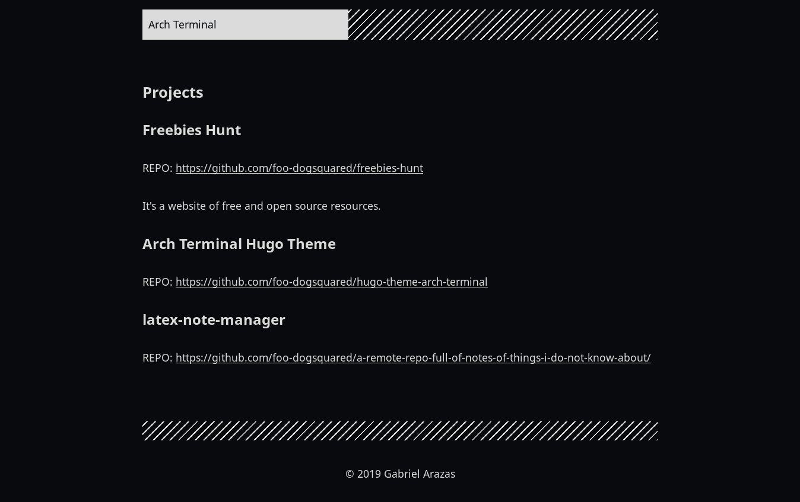
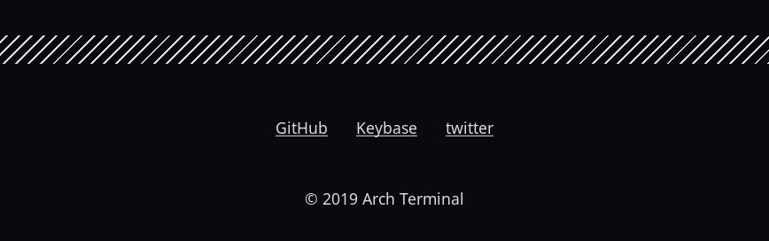

# Arch Terminal 

Table of Contents

* [Demo](#demo)
* [Manual](#manual)
* [Features](#features)
* [Installation](#installation)
* [Building with the theme](#building-with-the-theme)
* [Making it as a portfolio site](#making-it-as-a-portfolio-site)
* [Making it as a blogging theme](#making-it-as-a-blogging-theme)
* [Adding your own JS libraries](#adding-your-own-js-libraries)
* [Lazy syntax highlighting](#lazy-syntax-highlighting)
* [MathJax support](#mathjax-support)
* [How to contribute](#how-to-contribute)
* [License](#license)

A complete remake of the original [Hugo Terminal theme](https://github.com/panr/hugo-theme-terminal) 
with additional features, new development build, and a totally different 
philosophy. 
Also focuses on including support for Asciidoctor content. 

Aimed for technical writers, programmers, tech enthusiasts, and 
people with a do-it-yourself (DIY) spirit. 
It also aims to be a portfolio and/or blog of a single author. 
If it's supposed to be a site for multiple author, then this is not 
for you (or you could hack it yourself). 

This theme provides a minimal base theme while providing a lot 
of ways to customize it. 
It also goes out of its way as much as possible as a UI component  
for your content. 
(Meaning no custom shortcodes and frontmatter to deal with this theme.) 

Be sure to read the [manual](./MANUAL.adoc) for more details. 
Nonetheless, with minimal configuration, it should be still enough to get started writing  content. 


## Demo 

Demo is available 
[here](https://foo-dogsquared.github.io/hugo-theme-arch-terminal-demo/). 
The demo features more posts, serves as a documentation of some sort, and highlights with a 
detailed configuration. 

You can also look for a real-life example on [my frontpage](https://foo-dogsquared.github.io/) and 
[my blog](https://foo-dogsquared.github.io/blog). 

The raw files of the demo is available in 
[a GitHub repo](https://github.com/foo-dogsquared/hugo-theme-arch-terminal-demo/). 
I also recommend to see the 
[config file](https://github.com/foo-dogsquared/hugo-theme-arch-terminal-demo/blob/master/config.toml) 
used in the demo. 
It's also well-commented so you can use it as a starter configuration for this theme. 


## Manual  

This is more like a "Getting Started" guide so please read the 
[manual](./MANUAL.adoc) for more details. 
This document only opens up a part of the things that you can do with 
this theme. 

You think you can escape the manual? Not a chance. 


## Features

Here's a general list of options that you can set and experiment with this theme. 
(Note that all of the listed features needs to be manually activated. 
It's supposed to be minimal, after all.)

* Support RSS, Atom, and JSON feeds. 
* Suitable for creating a quick single homepage portfolio and/or blogging. 
* [MathJax](https://www.mathjax.org/) support. 
* Lazy syntax highlighting support with [highlight.js](https://highlightjs.org/) 
or [PrismJS](https://prismjs.com/). <sup>[[1](#footnoteref1)]</sup>
* Multilingual mode support. 
* Theme switch toggle (also known as dark mode).
* Customizable normal and alternate theme appearance. The theme will also set 
the alternate theme even if you didn't customize it yourself! 
(Though, may result in ugly colors.) <sup>[[1](#footnoteref1)]</sup>
* Site breadcrumbs. 
* LaTeX-like content counters. 
* Customizable social links. 
* Custom 404 messages. 
* Detailed or compact list for your posts on the homepage. 
* Custom content reader mode for easier readability for your readers. 
* JSON+LD schema. 
* Image zoom feature for your content. <sup>[[1](#footnoteref1)]</sup>
* Built-in search indexing and widget with [Fuse.js](https://fusejs.io/). <sup>[[1](#footnoteref1)]</sup>
* Quick taxonomy search query list. 
* Adding custom JS libraries for the whole site or for specific posts. 
* Google Analytics integration. 
* Disqus integration. 


## Installation 

This theme requires Hugo v0.58.0 and above. 
However, some of the features of this theme can only be used with the extended version 
(such as applying edited SCSS files) so make sure you have it installed 
if you want the full package. 

Also, the remote repo of this project is hosted on GitHub. 
Thus, it uses Git as the version control system. 

On your Hugo project, you can install the theme on two ways:


### Installing by cloning

You can simply clone the Git repo of the theme. 

```sh
git clone https://github.com/foo-dogsquared/hugo-theme-arch-terminal.git themes/arch-terminal # you can change it to an SSH link, if you use it
```

This is a good option if you don't to modify the base theme too much. 


### Installing with submodule 

You can also install the theme utilizing [Git submodules](GIT_SUBMODULES_LINK). 

```sh
git submodule add https://github.com/foo-dogsquared/hugo-theme-arch-terminal.git themes/terminal 
``` 

If you want to make major changes to the theme, then this might be the option 
you're looking for. 


## Building with the theme 

Now that you have the theme with the project, let's see it in action. 

Run the following command and see the result: 

```sh
hugo serve -t arch-terminal
``` 

You can also add the following into your site configuration to serve with the 
theme without repeating the above command:

```toml
theme = "arch-terminal" 
```


## Basic configuration 

To get started, you can start with a simple and minimal configuration and 
work your way out there. 

The theme is mostly suitable to be simple single-page portfolio or a blogging theme 
(or both). 

Want to start right away? Here's the most minimal configuration of the theme. 

```toml
title = "Arch Terminal"
```

Seriously, that's it. :) 
You just completed the "Hello World" of making a Hugo site. 
[Enjoy the view of your Hugo site with **T R U E M I N I M A L I S M** and no bloat.](./docs/true-hugo-minimalism.png)

Ignore my rambling and let's continue on to the README, shall we. 
Try to follow along the README, if you wish for a more fulfilling experience 
(of configuring a Hugo theme, that is). 


### Configuring appearance 

You can change the appearance of the theme. 
Start by copying `themes/arch-terminal/assets/scss/config.scss` to your own assets 
with similar directory structure (`assets/scss/config.scss`). 
**Note that you need to have Hugo extended version installed to apply edited SCSS stylesheets.** 
Otherwise, you would have to overwrite with a CSS stylesheet (at `scss/main.min.css`) instead and the 
following section does not apply anymore. 

Also, please open `themes/arch-terminal/assets/scss/default.scss` to see the 
variables needed. 

On second thought, here's the SCSS config file (as of 2019-09-07). 

```scss
// Create one at the similar location in your 
// Hugo directory. 

// To know what variables you should modify, take a 
// look at `default.scss`.

// Here's a sample custom config with pretty colors and everything 
// (at least for me) and try with the theme toggle switch. 
// If there's no alternative palette given, it will set the 
// alternate theme automatically for you.

// For those who cares about using font stacks, I've provided a quick list for you 
// It's a mixed combination of free and open source fonts and system fonts, 
// feel free to modify it as you wish
// Monospace: "Fira Code","Source Code Pro","IBM Plex","Monaco","Consolas","Ubuntu Mono","Bitstream Vera Sans Mono",monospace
// Sans: "Fira Sans","Copper Hewitt","IBM Plex",sans
// Serif: "Source Serif Pro","Charter","IBM Plex","Georgia",serif

// Here's a quick sample config for you. Try it out and enable theme toggling for a bit. 
// $background: #703d57;
// $foreground: #dce2c8;
// $accent: #f28a3c;
// $fontFamily: sans-serif;
// $fontSize: 1.2rem;
```

It's empty. You can try to uncomment the comments for a start or open up the 
`default.scss` file from the theme folder to see the available variables. 


### Setting alternative themes 

Here's the best part, it can generate an alternative theme (dark mode or whatever) 
automatically even if you provide those variables. 

Please uncomment the part with the SCSS variables and add the `params.enableThemeToggle` 
in your site configuration like so:

```toml
[params]
    # ... 
    enableThemeToggle = true
```

And see the magic alternative toggle! 

Go on and change the colors and believe! 


## Making it as a portfolio site 

If you're only using this theme as a portfolio site, the theme only requires 
the following configuration settings in your site configuration (aside from the 
usual): 

* `title` - the title of your site
* `author.name` - the full name of the author 

That's it. 
Of course, it'll result in a barebone portfolio page. 
You can see more options in the [manual](./MANUAL.adoc) at the 
*Making a portfolio site* section. 


### Adding projects 

What would a portfolio be without some featured works? 

In order to show your projects, the theme requires a data file named 
`projects` (`data/projects.{yaml,json,toml}`). 
Make sure that the data file holds a list of objects with specific key/fields. 

I'll show you an example first before showing the required keys. 
The example will be in JSON format since it is easy to create a root array with it. 

```json
[
    {
        "id": "freebies-hunt",
        "name": "Freebies Hunt",
        "link": "https://freebies-hunt.netlify.com/",
        "repo": "https://github.com/foo-dogsquared/freebies-hunt",
        "description": "It's a website of free and open source resources."
    },
    {
        "id": "hugo-theme-arch-terminal",
        "name": "Arch Terminal Hugo Theme",
        "repo": "https://github.com/foo-dogsquared/hugo-theme-arch-terminal"
    },
    {
        "id": "latex-note-manager",
        "repo": "https://github.com/foo-dogsquared/a-remote-repo-full-of-notes-of-things-i-do-not-know-about/"
    }
]
``` 

Here are the following keys that the theme finds and how it relates with the 
output:

* `id` - The identifier of the project. It'll be used as the basis for sorting 
the project list. Take advantage of this if you want certain projects to be 
featured first. _It is required._

* `name` - The name of the project that'll appear in the output. This is an 
optional key. If there's no `name` key, it'll use the `id` as the name, instead. 

* `link` - The working link of the project. It could be an optional website or 
the working version of the web app. You should not put the software repo link 
here. Also optional. 

* `repo` - The repo of the project whether be it a GitHub repo, Sourceforge page, 
or a Subversion repo. It is an optional key. 

* `description` - The description of the project. Optional as eff. 

If you have a valid data at the ready and compiled it with the theme, you should 
have a projects section at your homepage. 

With the earlier example, it should show similar to the result below:

 

Yeah. It's lacking something. Let's add some contact links for the porfolio. 


### Adding contact 

What would a portfolio be without the creator's recognition? 

You can add a list of contact by providing a data file named `contacts` 
(`data/contacts.{json,yaml,toml}`). 
Similar to the projects data file, it should hold a list/array of objects with 
specific keys/fields. 

Like with the projects, I'll show you another example first. 
And another thing... it'll be in JSON format again. 

```json
[
    {
        "id": "github",
        "url": "https://github.com/foo-dogsquared/",
        "name": "GitHub"
    },
    {
        "id": "keybase",
        "url": "https://keybase.io/foo_dogsquared",
        "name": "Keybase"
    },
    {
        "id": "twitter",
        "url": "https://twitter.com/foo_dogsquared"
    }
]
``` 

Now, the list of keys. Thankfully, it's a lot shorter this time. 

* `id` - The identifer of the contact. Similar to the `id` key from 
the `projects` data. 

* `url` - The URL of the contact link. 

* `name` - The name that'll appear in the output. Similar to the `name` key 
from the `projects` data, it'll use the `id` key if it's absent. 
**This key is optional.**

The results from the previous example? A list of contact links in the footer. 

 


### Filling the rest of the content

Something's missing in the portfolio. 
Oh! It's the description (and perhaps other stuff). 
You can simply create a new content file named `_index.{md,adoc}` and write 
some stuff about it. 

You can create another page at `content/$NAME.{md,adoc}` and write some more. 
However, the theme will not list any top-level pages. 
That's convenient. Though, I do need a way to make it accessible for the visitor. 

A simple problem requires simple answer. We'll just add it into the main menu at 
the header. 

Configuring menus is not different from any other themes (though, nested menus 
are not supported). 

Let's say we have the following content directory structure:

```sh
content
├── about.adoc
├── contact.adoc
└── _index.adoc # This is your homepage content
```

To make them accessible through a menu, simply write similar configuration that follows:

```toml
[menu]
    [[menu.main]]
        identifier = "about"
        name = "About"
        url = "about/"

    [[menu.main]]
        identifier = "contact"
        name = "Contact"
        url = "contact/"
        
```

Ta-da! Now, you have a simple and complete portfolio page with the projects, contacts, 
stuff, and everything! 


### Other options 

You can fiddle with other options. 
Please see [the manual](./MANUAL.adoc) for more information and options. 

I'm pretty sure you want to see how to configure some theme and alternative themes, 
or how you could add a quick support section where you can e-beg for stuff. 


## Making it as a blogging theme 

Let's say you want to make it as a blogging theme as well. 
This theme has you covered. 

Take note that most of the stuff from making the portfolio site applies to 
this section. 

Compared to configuring it as a portfolio site, this is where you'll seeing 
[the manual](./MANUAL.adoc) multiple times. 
Be sure to know it well so you'll have less problems settling with this theme. 

Now, the theme aims to be minimal but customizable enough. 
Unfortunately, the theme takes the meaning of minimal to its heart. 
Therefore, some of the usual features you would normally see in most of the 
Hugo themes are disabled by default and you have to manually activate it. 

* Hiding posts on the homepage? You have to set `params.hidePostsOnHome` to `true` for that. 

* A theme toggle switch (dark mode toggle)? Turn the `params.enableThemeToggle` on, please. 

* How about some lazy syntax highlighting where you don't have to rely on the 
`highlight` shortcode? Activate the `params.enableLazySyntaxHighlighting` switch! 

* Can you please turn on the MathJax support on `params.enableMathjax`, honey? I'm dying 
of the lack of MathJax support over here.  

* Have you forget to check if the `params.enableContentPagination` is on again? 
Now I don't have a "Read more" section on my post page. 

* Thanks, sir! Good thing you enabled `params.enableBreadcrumbs` or else I would've lost 
in that website for hours on end! 

If those situations happened to you previously, 
[you should've read the manual more](./MANUAL.adoc) and check the _Making a blog site_ section 
to see the available options. 


### Content frontmatter 

The theme doesn't have much options for the frontmatter since it goes out of its 
way as much as possible to future-proofing your content with less frontmatter. 

But here's the list of the fields that the theme covers:

* `title`, `author`, and `date` which is the usual stuff. 

* `tags` and `categories` which is also the usual stuff. 
They are the [default taxonomies](https://gohugo.io/content-management/taxonomies/#default-taxonomies). 

* `cover` which is the featured cover image in the post. 
I think this is the only custom field (aside from the `libs` which is discussed below). 


### Starter configuration 

If you don't want to check the options for now, here's a starter config you 
can fiddle around with. 
Simply uncomment/comment the options that you want to enable/disable. 
It should be enough for starting a "minimal" blog site.

```toml
baseURL = "https://example.com/"
languageCode = "en-us"
title = "Arch Terminal"
description = "Generic description!"
summaryLength = 15
paginate = 5
copyright = "Unless explicitly stated, all content released here are licensed under [CC BY-NC-SA 4.0](https://creativecommons.org/licenses/by-nc-sa/4.0)."
canonifyURLs = true

[params]
    # The subtitle of the blog. Mostly appears in the <title> tag.
    subtitle = "Blogger"
    keywords = ["John Dodo", "ordinary-extinction", "blog"]

    # The tagline that'll appear in the homepage as the first header. 
    tagline = "Making near destructive blogs all around the world."
    
    # Indicates if the site sections should be listed instead.
    # Requires `hidePostsOnHome` to be disabled.
    # listSiteSectionsOnHome = true 

    # Puts a pagination section on the posts linking to the previous and next posts.
    # enableContentPagination = true
    
    # Indicates to show the icon whether the link leads to a page or a section. 
    # The effect is visible if `hidePostsOnHome` is at least disabled. 
    # showPageTypeIcon = true

    # 404
    notFoundHeader = "404 Not Found :("
    notFoundLinkMessage = "Now get back here."
    notFoundMessage = "I see you're an explorer. I like that."
``` 

### Advanced configuration 

Here's a sample of a more advanced configuration made for configuring this theme. 
This includes RSS, Atom, and JSON feeds, SEO improvements, additional configurable 
views for your homepage and content, MathJax support, lazy syntax highlighting, 
and other tiny stuff. 

Like the starter config, you can simply uncomment/comment certain things for 
the features that you want to enable/disable. 

```toml
baseURL = "https://example.com/"
languageCode = "en-us"
title = "Arch Terminal"
description = "Generic description!"
summaryLength = 15
paginate = 5
copyright = "Unless explicitly stated, all content released here are licensed under [CC BY-NC-SA 4.0](https://creativecommons.org/licenses/by-nc-sa/4.0)."
canonifyURLs = true 

# Defining the media type of the RSS and Atom feeds 
# (you don't need to configure for JSON feeds since it's set at `index.json`) 
[mediaTypes]
    [mediaTypes."application/atom+xml"]
        suffixes = ["atom", "atom.xml"] # You can remove the "atom.xml" if you want
    
    # Redefining RSS media type for the additional suffix
    [mediaTypes."application/rss+xml"]
        suffixes = ["rss", "rss.xml"] # You can remove the "rss.xml" if you want
    
    # You can set any media type you want but make sure it doesn't have any conflict with 
    # other media types (that'll be used by your site, anyway).
    # Here's the list of registered media types for a reference.
    # https://www.iana.org/assignments/media-types/media-types.xhtml
    [mediaTypes."x-application/search+json"]
        suffixes = ["search.json"]

# Including all of the feed output formats in the build
[outputFormats]
    [outputFormats.Rss]
        mediaType = "application/rss+xml"
        baseName = "index"

    [outputFormats.Atom]
        mediaType = "application/atom+xml"
        baseName = "index"
    
    [outputFormats.SearchIndex]
        mediaType = "x-application/search+json"
        baseName = "index"

# Indicating what output formats shall be included for the following kinds
[outputs]
    # .Site.BaseURL/index.* is available 
    home = ["HTML", "JSON", "RSS", "ATOM", "SEARCHINDEX"]

    # .Site.BaseURL/$section/index.* is available
    section = ["HTML", "JSON", "RSS", "ATOM"] 

# Your parameters for the theme
[params]
    # The subtitle of the blog. Mostly appears in the <title> tag.
    subtitle = "Blogger"
    keywords = ["John Dodo", "ordinary-extinction", "blog"]

    # The tagline that'll appear in the homepage as the first header. 
    tagline = "Making near destructive blogs all around the world."
    
    # Hide posts on home. :)
    # hidePostsOnHome = true

    # SEO improvements
    # enableTwitterCard = true 
    # enableOpenGraphSchema = true 
    # enableJsonLdSchema = true 
    
    # Indicates if the site sections should be listed instead.
    # Requires `hidePostsOnHome` to be disabled.
    # listSiteSectionsOnHome = true 

    # Puts a pagination section on the posts linking to the previous and next posts.
    # enableContentPagination = true

    # Enable content reader mode for decluttered interface for your visitors 
    # enableContentReaderMode = true

    # Include image zoom feature similar to Medium articles
    # enableContentImageZoom = true

    # Enable compact list view for your post lists
    # enableCompactListMode = true

    # Enables syntax highlighting. ;p
    # enableLazySyntaxHighlighting = true

    # Set the syntax highlighter to be used. 
    # Only valid options are "highlighterjs" or "prismjs".
    # By default, it uses highlighter.js as the syntax highlighter if there's no set value. 
    # syntaxHighlighter = "prismjs"
    
    # Indicates to show the icon whether the link leads to a page or a section. 
    # The effect is visible if `hidePostsOnHome` is at least disabled. 
    # showPageTypeIcon = true
    
    # Shows breadcrumbs in the post.
    # enableBreadcrumbs = true

    # Places a theme toggle button at the header logo
    # enableThemeToggle = true

    # Enable MathJax support
    # enableMathjax = true

    # If you want to use MathJax v2
    # setMathjaxToV2 = true

    # 404
    # notFoundHeader = "404 Not Found :("
    # notFoundLinkMessage = "Now get back here."
    # notFoundMessage = "I see you're an explorer. I like that."

    # Enable content counters similar to LaTeX counters
    # useContentCounters = true 
```


### RSS, Atom, and JSON feeds support 

For those who are looking to find more ways of distributing their content into the 
world of crap, an output feed might fill your needs. 

This theme support three major output feed formats: 
[RSS](https://cyber.harvard.edu/rss/rss.html), [Atom](https://tools.ietf.org/html/rfc4287), 
and [JSON feeds](https://jsonfeed.org/). 
The theme also support output feeds for site sections so that your visitors 
can subscribe to only a specific section of your site. 

In order to enable it, utilize [custom output formats](https://gohugo.io/templates/output-formats) 
to your Hugo site config. 

Here's a sample template of enabling support of all of them. 

```toml
[mediaTypes]
    [mediaTypes."application/atom+xml"]
        suffixes = ["atom"]
    
    [mediaTypes."application/rss+xml"]
        suffixes = ["rss"]

[outputFormats]
    [outputFormats.RSS]
        mediaType = "application/rss+xml"
        baseName = "index"
        isPlainText = false
        
    [outputFormats.Atom]
        mediaType = "application/atom+xml"
        baseName = "index"
        isPlainText = false

[outputs]
    home = ["HTML", "RSS", "ATOM", "JSON"]
    section = ["HTML", "RSS", "ATOM", "JSON"]

```

You can access them through `{{ $.Site.BaseURL }}/index.{rss,atom,json}`. 

For specific site sections, you can visit them through the following template link: 

```
{{ $.Site.BaseURL }}/{{ section }}/index.{rss,atom,json}
```


## Adding your own CSS and JS libraries 

### Adding it sitewide

This theme supports adding your own set of third-party (or your own) libraries to 
your site. 
Thus, it can bring some features you want such as additional support for 
engineering-focused content with third-party libraries such as 
[Mermaid](https://mermaidjs.github.io/) and [Chart.js](https://www.chartjs.org/). 
You can also replace MathJax with [KaTeX](https://katex.org/) or replace 
the syntax highlighter libraries used here. 

It can be done by utilizing a data file named `libraries` that holds a list of 
objects with the following keys:

* `type` (string) indicates the type whether it's a CSS or a JS library. 
Can only accept possible values, `css` and `js`. 

* `url` (string) which is the source of the script. 
Also accepts relative links from your site which you can bring through 
the [static folder](https://gohugo.io/content-management/static-files/). 

* `weight` (number) dictates the importance of the script. 
The less weight, the higher the precedence so make sure the important scripts 
have the least weight value. 

* `sync` (boolean) indicates that the script shall be included with the 
page rendering. 
All scripts will be asynchronously delivered (with `async` attribute). 
Also, it'll bring down the perceived performance so make sure the 
script you'll be setting with this `key` is quite important to be loaded first. 
**This key is optional.** 

* `defer` (boolean) indicates that the script will be deferred. 
Once the value is `true`, the script will be deferred no matter what. 
**This key is optional.** 

If you want finer control, I recommend to copy the script partial of this theme 
(at `themes/$THEME_NAME/layouts/partials/scripts.html`) and modify it. 


### Adding it for specific posts 

| Tip |
| --- |
| If you plan on future-proofing your content, I recommend to embed them in the document instead. This is a theme-specific feature and may pose some problems in the future when you're going to migrate it. |

You can also add libraries for specific posts by providing the `libs` in the 
content frontmatter. 
It is based on one of the content from the [basic example](https://github.com/gohugoio/hugoBasicExample/blob/master/content/sketch/lines-from-center.html). 

It is more or less the same. 
The `libs` key is an object/dictionary where it describes CSS and JS libraries. 

Here's the frontmatter from the previously linked example. 

```yaml
---
title: "Lines from center"
date: 2019-03-04T22:15:42-03:00
description: "this is a p5js sketch"
libs:
  js:
    - https://cdnjs.cloudflare.com/ajax/libs/p5.js/0.7.3/p5.min.js
---
```

When the page is built, it'll have the p5.js library on the page specifically for 
that post. 

Take note that all of the scripts included in this way are deferred. 
If you want finer control (with the added benefit of future-proofing your content 
since this is theme-specific feature), you can embed them on the document itself, 
instead. 

For Markdown files, you can simply write raw HTML. 
For Asciidoctor documents, you can write the HTML inside of a 
[passthrough block](https://asciidoctor.org/docs/user-manual/#passthroughs). 


## Lazy syntax highlighting 

**This feature is only possible with Hugo extended verison.** 
You can get around this with using the `libraries` data file. 

The theme supports lazy syntax highlighting (that doesn't rely on the 
`highlight` shortcode) by setting `params.enableLazySyntaxHighlighting` 
to `true`. 

This theme utilizes two syntax highlighting libraries for this which are 
[highlight.js](https://highlightjs.org/) and [PrismJS](https://prismjs.com/). 
By default, it relies on highlight.js library. 
You can set the theme to use PrismJS library by setting `params.syntaxHighlighter` 
to `prismjs`. 

Take note that all of the syntax highlighters used here has all of the 
languages as the packages. 
For PrismJS, it also has the "Keep Markup" plugin. 
If you want to replace the files, the scripts are located at `assets/js/lib` 
of the theme folder. 


## MathJax support 

This theme supports mathematical typesetting with [MathJax](https://www.mathjax.org/). 
Like any of the features here, you have to manually activate it with 
`params.enableMathjax` with a `true` value. 

By default, the theme use MathJax v3.0.0 (as of 2019-09-10). 
If you want to use the previous major version for some reason, you can simply set 
`params.setMathjaxToV2` to `true`. 

If you want to configure MathJax, you can create a file in `layouts/partials/config/mathjax.html` 
in the root folder and write it there. 

Unlike most of the features that relies on the third-party libraries, this feature 
specifically links through a CDN for performance reasons (and easy web caching for 
other websites to use). 
If by any chance repulsed from this idea, you can use a local copy of MathJax by 
setting `params.useLocalMathjax` on. 
**Take note this only works when you have Hugo extended version installed and only works with MathJax v3.** 
Also, take extreme consideration and caution when enabling this since it'll 
cause a 2.5MiB increase of the bandwidth to be used by your site. 


## How to contribute

If you spot some bugs or want to suggest a feature, feel 
free to file an issue in the issue tracker. 

Any feature requests are heavily considered since starting at v2.0.0, a 
feature freeze is observed for the sake of improving user experience 
(including the documentations), bug fixes, and content readability for the theme 
as much as possible. 
It also avoids the problem of over-engineering and gold plating since the 
theme already has a lot of options/parameters to offer. 


### Setting up for development

If you want to contribute through code, you can do the following 
to set up the repo into your computer:

* Fork this repository 
* Clone the forked repository 
* Checkout to the development branch (`develop`) 
* Create another branch from the development branch which you can 
freely implement your own stuff 

Make sure the new branch name is appropriately named. 

If creating a pull request, you have to pass it through the 
development branch. 


### Project style guides

If you're going to update the codebase, make sure you mind the 
following guidelines:

* The documentations have to be written in [Asciidoctor](https://asciidoctor.org/). 
If you're not familiar with it, here's the 
[quick reference page](https://asciidoctor.org/docs/asciidoc-syntax-quick-reference/) for 
a rundown and their [user manual](https://asciidoctor.org/docs/user-manual/) for 
deep details. 
* The codebase follows the [BEM naming convention](http://getbem.com/naming/) 
for the CSS naming.
* Using [semantic HTML](https://developer.mozilla.org/en-US/docs/Web/Guide/HTML/Using_HTML_sections_and_outlines) 
should be observed.
* Not really a requirement but use the [EditorConfig](https://editorconfig.org/) 
plugin for your text editor. 
If you don't have any, try to follow according to the `.editorconfig` rules. 


## License

For the original theme, copyright goes to Radosław Kozieł 
([@panr](https://twitter.com/panr)).

The original theme is released under the MIT License. 
Check the 
[original theme license](https://github.com/panr/hugo-theme-terminal/blob/master/LICENSE.md)
for additional licensing information.

This fork is maintained by [foo-dogsquared](https://foo-dogsquared.github.io/) 
and the extended theme is released under MIT license. 
Copyright applies to my own modifications of the project. 
Please see the previously linked license of the theme for more 
information on how to properly include copyright notices.

In other words:

© 2019 panr - for the original theme

© 2019 foo-dogsquared - for the modification and extended 
parts of the theme 

(IDK how to proceed with licensing so feel free to correct me pls -_-)

<a id="footnoteref1">[1]</a>: Requires Hugo extended version
